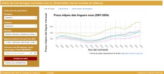

<div class= "header">
<p class="left-side">
Els ODS als municipis de Catalunya - Actualització 2025
</p>
<span class="right-side"> <a href="https://gaiacooperacion.net" target="_blank" style="color: white; font-size:12pt; font-weight:normal; position:absolute; top:0px; right:320px;">Disseny:</a> <a href="https://dialoguia.cat" target="_blank" style="color: white; font-size:12pt; font-weight:normal; position:absolute; top:10px; right:100px;">Concepte:&nbsp;</a>
<a href="https://analysis.cat" target="_blank"></a>
</span>
</div>


```{r include=FALSE}
knitr::opts_chunk$set(cache = FALSE)
```


```{r setup, include=FALSE}
library(flexdashboard)
library(tidyverse)
library(sf)
library(rmapshaper)
library(tmap)
library(leaflet)
library(readxl)
library(httr)
library(plotly)
library(DT)
library(crosstalk)
library(viridis)
library(hrbrthemes)

```

```{r include=FALSE}
# MAPAS

# Mapa comarques
com_sf <- st_read(
    "Mapas/divisions-administratives/divisions-administratives-v2r1-comarques-500000-20240118.shp")|> 
  st_make_valid() |> 
  rmapshaper::ms_simplify(keep = 0.025, keep_shapes = TRUE)

# Mapa províncies
prov_sf <- st_read(
    "Mapas/divisions-administratives/divisions-administratives-v2r1-provincies-500000-20240118.shp")

# Mapa municipis
mun_sf <- st_read(
    "Mapas/divisions-administratives/divisions-administratives-v2r1-municipis-250000-20240118.shp") |> 
  st_make_valid() |> 
  rmapshaper::ms_simplify(keep = 0.025, keep_shapes = TRUE) %>%  # Importante para poder simplificar el mapa sin dejar espacios vacíos. Hay que simplificar para bajar el peso del documento
    mutate(CODIMUNI= str_sub(CODIMUNI,1,5)) # NOTA IMPORTANT: Tenir present que, en el cads de Catalunya, la codificació és de SIS DÍGITS: els dos primers corresponen al codi de província, els tres següents a l'identificador seqüencial de municipi i l'últim és un DÍGIT DE CONTROL.

```

```{r}

# Dataframe general de población total por municipios, para join con df que tienen código ine
# Años 2019, 2020, 2021, 2022, 2023
# Datos: https://www.ine.es/dynt3/inebase/index.htm?padre=10607&capsel=10607


municipios <- readxl::read_xlsx("BasesdeDatos/Demografia/padronMunicipios.xlsx")

# Se separan diferentes df para diferentes años

municipios_21 <- municipios |> select(1,2,6)
municipios_22 <- municipios |> select(1,2,5)
municipios_23 <- municipios |> select(1,2,4)
municipios_24 <- municipios |> select(1,2,3)

```

```{r}
# Población por edad año a año
# https://www.idescat.cat/pub/?id=pmh&n=1180&by=sec&t=2022&f=zip&fi=ssv

mun_anyoanyo_2022 <- read_xlsx("BasesdeDatos/Demografia/Padron_Anyo-Anyo/pobAnyany22.xlsx")

mun_anyoanyo_2023 <- read_xlsx("BasesdeDatos/Demografia/Padron_Anyo-Anyo/pobAnyany23.xlsx")

mun_anyoanyo_2024 <- read_xlsx("BasesdeDatos/Demografia/Padron_Anyo-Anyo/pobAnyany24.xlsx")


```

```{r}

# Dataframe amb dades generals municipis (altitud, superfície etc)

info_mun <- read.csv("BasesdeDatos/Demografia/t15903_SupAlt.csv",
         skip = 5,
         sep = ";",
         header = TRUE,
         colClasses = c("character","character","character",
                       "character","character","character")) %>%
    mutate(Superfície..km..= gsub(",","\\.",Superfície..km..),
           Superfície..km..= as.numeric(Superfície..km..),
           Altitud..m.= as.integer(Altitud..m.),
           Població= as.integer(Població),
           Codi= str_sub(Codi, 1, 5),
           Densitat_h.km2= round(Població/Superfície..km..,1)) %>% 
    rename(ine=Codi)


```

```{r}

# dataframe depurado de municipios para join con dataframe sin código ine, sino por nombre del municipios
munClean <- municipios_23[, c(1,2)] |> 
    mutate(Municipio= tolower(Municipio),
           Municipio= stringi::stri_trans_general(Municipio, "Latin-ASCII"),
           Municipio= sub("^l'(.*)", "\\1 l'", Municipio),
           Municipio= gsub("'", "", Municipio),
           Municipio= gsub("`", "", Municipio),
           Municipio= gsub("´","", Municipio),
           Municipio= gsub(",", "", Municipio),
           Municipio= gsub("\\(", "", Municipio),
           Municipio= gsub(")", "", Municipio),
           Municipio= trimws(Municipio, "both"),
           Municipio= gsub("\\s+"," ", Municipio))
   

# writexl::write_xlsx(munClean,"BasesdeDatos/ODS7/munClean.xlsx")

```

# Mapes ODS1 {data-navmenu="ODS1 - Fi de la pobresa"}

## Column {.tabset}

### Renda Familiar Disponible Bruta per habitant <br> (2022 - provisional) <br> <c style= "font-size: 10px;"> <i>Elaboració pròpia sobre dades de l'IDESCAT (2022)</i></c>

```{r}

rdfb <- read_xlsx("BasesdeDatos/ODS1/rfdbc-21181-25017-mun.xlsx",
         sheet = 2,
         skip=1,
         col_names = TRUE) %>% 
    mutate(ine= str_sub(...1, 2,6),
           Municipio= str_sub(...1,9,100)) %>% 
    select(9,10,2:8) %>% 
    filter(grepl("^08|^17|25|^43", ine))

rdfb22 <- rdfb %>% select(1,2,3) %>% 
    rename(ods01.rdfb.hab= `2022`)

ods1.rdfb_sf <- mun_sf %>% left_join(rdfb22, by= c("CODIMUNI"="ine"))

tmap_mode("view")

tm_shape(ods1.rdfb_sf)+
    tm_fill(col="ods01.rdfb.hab",
            id="NOMMUNI",
            #style = "fixed",
            #n=5,
            #breaks = c(0,50,100,1000,2000,5000),
            palette = c("white","darkgreen"),
            title = "Renda Familiar Disponible Bruta per hab.",
            legend.format = list(text.separator= '-'),
            textNA = 'Sense dades',
            popup.vars=c("RDFB per hab. (€): "= "ods01.rdfb.hab"),
            popup.format = list(ods01.rdfb.hab= list(big.mark = "."))
            ) +
    tm_borders(col="grey40",lwd=0.5)+
    tm_shape(com_sf) +
  # Change col and lwd of neighborhood boundaries
    tm_borders(col="grey40", lwd=2)+
    tmap_options(check.and.fix = TRUE) +
    tmap_options(basemaps = "Esri.WorldImagery",
               basemaps.alpha = 1)


```

### Taxa de població en pobresa severa <br> <c style= "font-size: 10px;"> <i>Elaboració pròpia sobre dades de l'INE (2022)</i></c>

```{r}

# Lectura de las bases de datos del INE descargadas en el enlace:

# https://www.ine.es/jaxiT3/Tabla.htm?t=309018&L=
pobrB <- read_xlsx("BasesdeDatos/ODS1/30901_PobrezaBarcelona.xlsx",
                   skip = 8,
                   col_names = TRUE)


# https://www.ine.es/jaxiT3/Tabla.htm?t=31021&L=0
pobrG <- read_xlsx("BasesdeDatos/ODS1/31021_PobrezaGirona.xlsx",
                   skip = 8,
                   col_names = TRUE)

# https://www.ine.es/jaxiT3/Tabla.htm?t=31084&L=0
pobrL <- read_xlsx("BasesdeDatos/ODS1/31084_PobrezaLleida.xlsx",
                   skip = 8,
                   col_names = TRUE)

# https://www.ine.es/jaxiT3/Tabla.htm?t=31228&L=0
pobrT <- read_xlsx("BasesdeDatos/ODS1/31228_PobrezaTarragona.xlsx",
                   skip = 8,
                   col_names = TRUE)

pobr <- rbind(pobrB,pobrG,pobrL,pobrT)

ods01.PobrSev <- pobr %>%  
    rename(Municipio= ...1)  %>%  
    mutate(ine= str_sub(Municipio,1,5),
         Municipio=str_sub(Municipio,7,100)) %>% 
    mutate(across(2:9, ~as.numeric(.))) %>%  
    select(10,1,2) |> 
    filter(grepl("^08|^17|^25|43", ine)) %>% 
    rename(ods01.PobrSev= `2022`)

# writexl::write_xlsx(pobr, "BasesdeDatos/ODS7/pobreza.xlsx") # Se graba para analizar correlación con otras variables

# NOTA IMPORTANT: Tenir present que, en el cas de Catalunya, la codificació és de SIS DÍGITS: els dos primers corresponen al codi de província, els tres següents a l'identificador seqüencial de municipi i l'últim és un DÍGIT DE CONTROL. En aquest cas, hem d'eliminar el dígi de control de l'arxiu cartogràfic perquè les bbdd de l'ine no el contenen.

  
pobr_sf <- mun_sf %>% inner_join(ods01.PobrSev, by= c("CODIMUNI"="ine"))

tm_shape(pobr_sf)+
    tm_fill(col="ods01.PobrSev",
            id="Municipio",
            #style = "fixed",
            #n=5,
            #breaks = c(0,50,100,1000,2000,5000),
            palette = c("papayawhip","darkred"),
            title = "Taxa de pobresa severa (%)",
            legend.format = list(text.separator= '-'),
            textNA = 'Sense dades',
            popup.vars=c("Taxa de obresa severa (%): "= "ods01.PobrSev")) +
    tm_borders(col="grey40",lwd=0.5)+
    tm_shape(com_sf) +
  # Change col and lwd of neighborhood boundaries
    tm_borders(col="grey40", lwd=2)+
    tmap_options(check.and.fix = TRUE) +
    tmap_options(basemaps = "Esri.WorldImagery",
               basemaps.alpha = 1)

```

## Column

### Taxa de despesa municipal en promoció social <br> <d style= "font-size: 10px;">Despeses mitjanes per hab. en serveis de promoció social. Compte 23 de Programes</d> <br> <c style= "font-size: 10px;"> <i>Elaboració pròpia sobre dades del Ministerio de Hacienda y Función Pública (anys 2021, 2022, 2023)</i></c>

```{r}

# Contabilidad de la partida 23 del gasto municipal del año 2021-2023
desp23_23 <- read_xlsx("BasesdeDatos/ODS1/Gasto21-23/desp23-2023.xlsx")
desp23_22 <- read_xlsx("BasesdeDatos/ODS1/Gasto21-23/desp23-2022.xlsx")
desp23_21 <- read_xlsx("BasesdeDatos/ODS1/Gasto21-23/desp23-2021.xlsx")

desp23 <- rbind(desp23_21,desp23_22,desp23_23)


desp23Cat <- desp23 %>% 
  filter(TipoAdm== "AA") %>%  
  group_by(ine,anyo) %>% 
  summarise(Gasto_23 = sum(Importe)) %>%  # Se calcula el importe por municipio y anyo
  ungroup() %>% 
  inner_join(municipios_22, by= "ine") |> # es fusiona amb df de municipis catalans any 2022
  group_by(ine) |> # Se agrupa por municipios
  mutate(PrSocMed= mean(Gasto_23)) |>  # y se calcula el gasto medio
  ungroup() |> 
  select(1,4,5,6) |> 
  rename(Total= `2022`) |> # Población total
  distinct(ine, .keep_all = TRUE) |> 
  mutate(ods01.Gasto_23perHab= round(PrSocMed/Total,2), # Gasto medio /hab. sobre población de 2022
         ods01.Gasto_en_miles= round(PrSocMed/1000,2))


d23Cat_sf <- mun_sf %>% left_join(desp23Cat, by= c("CODIMUNI"="ine"))

tm_shape(d23Cat_sf)+
    tm_fill(col= "ods01.Gasto_23perHab",
            id="NOMMUNI",
            style = "fixed",
            n=5,
            breaks = c(0,50,100,200,400,5000),
            palette = c("white","darkgreen"),
            title = "Despesa mitjana (21-23) <br> partida social per habitant",
            legend.format = list(text.separator= '-'),
            textNA = 'Sense dades',
            popup.vars=c("Despesa social (en mils d'€): "= "ods01.Gasto_en_miles",
                         "Població (habitants): "= "Total",
                         "Despesa social/Habitant: "= "ods01.Gasto_23perHab"),
            popup.format = list(ods01.Gasto_en_miles= list(big.mark = ".",
                                               decimal.mark= ","),
                                Total= list(big.mark = "."),
                                ods01.Gasto_23perHab=list(decimal.mark=","))) +
    tm_borders(col="gray30",lwd=0.5)+
    tm_shape(com_sf) +
  # Change col and lwd of neighborhood boundaries
    tm_borders(col="grey40", lwd=2)+
    tmap_options(check.and.fix = TRUE)

 

```

```{r}
#knitr::knit_exit()

```


# Anàlisi ODS1 {data-navmenu="ODS1 - Fi de la pobresa"}

## Column

### Distribució entre municipis de la Renda familiar disponible bruta per hab.: comparació per províncies {data-height="500"}

```{r fig.width=7}

rdfb22 %>% 
    mutate(Provincia= ifelse(grepl("^08",ine), "Barcelona",
                             ifelse(grepl("^17",ine), "Girona",
                                    ifelse(grepl("^25", ine), "Lleida",
                                           ifelse(grepl("^43", ine), "Tarragona",
                                                  NA))))) %>% 
    group_by(Provincia) %>% 
    mutate(mediana= median(ods01.rdfb.hab, na.rm= TRUE)) %>% 
    ggplot(aes(x= Provincia, y= ods01.rdfb.hab,fill = Provincia))+
    geom_boxplot()+
    theme_ipsum()+
    scale_color_viridis(discrete=TRUE, aesthetics = "fill") +
    #geom_text(aes(y= mediana,label = mediana), vjust= -0.5 )+
    ylab("RDFB per habitant")+
    theme(legend.position = "none")


```

### Distribució entre municipis de la Taxa de pobresa severa: comparació per províncies

```{r}

ods01.PobrSev %>% 
    mutate(Provincia= ifelse(grepl("^08",ine), "Barcelona",
                             ifelse(grepl("^17",ine), "Girona",
                                    ifelse(grepl("^25", ine), "Lleida",
                                           ifelse(grepl("^43", ine), "Tarragona",
                                                  NA))))) %>% 
    group_by(Provincia) %>% 
    mutate(mediana= median(ods01.PobrSev, na.rm= TRUE)) %>% 
    ggplot(aes(x= Provincia, y= ods01.PobrSev))+
    geom_boxplot(aes(fill = Provincia))+
    theme_ipsum()+
    scale_fill_viridis(discrete = TRUE, aesthetics = "fill")+
    ylab("Taxa de pobresa severa")+
    theme(legend.position = "none")


```

## Column{.tabset}

### Relació entre Renda disponible familiar bruta i Taxa de pobresa severa

```{r }

rdfb_pob <- municipios_22 %>% 
    inner_join(ods01.PobrSev[, c(1,3)]) %>% 
    mutate(Provincia= ifelse(grepl("^08",ine), "Barcelona",
                             ifelse(grepl("^17",ine), "Girona",
                                    ifelse(grepl("^25", ine), "Lleida",
                                           ifelse(grepl("^43", ine), "Tarragona",
                                                  NA))))) %>% 
    inner_join(rdfb22, by= 'ine') %>% 
    rename(Poblacio= `2022`) %>% 
    filter(!is.na(ods01.rdfb.hab))

R <- cor(rdfb_pob$ods01.PobrSev, rdfb_pob$ods01.rdfb.hab, method = 'pearson')


    
ggplot(rdfb_pob, aes(x=ods01.rdfb.hab, y= ods01.PobrSev)) +
    geom_point(aes(text= paste0("Municipio: ", Municipio.x,
                                "\nRenda Disponible Familiar Neta / Hab.: ", ods01.rdfb.hab, "\nTaxa de risc de pobresa (%): ", ods01.PobrSev
                                ),
                   colour = Provincia,
                   size= Poblacio),
               alpha= 0.5) +
    geom_smooth(method = 'lm', se=FALSE) +
    theme_ipsum() +
    scale_color_viridis(discrete = TRUE)+
    scale_size(2,15)+
    geom_text(aes(x=25000,y=12.5,
                  label = paste0("R= ", round(R,2))))+
    ylab("Taxa pobresa severa")+
    xlab("Renda disponible familiar bruta/hab.")+
    guides(size= "none") +
    guides(colour = guide_legend(override.aes = list(size=8)))
  
#ggplotly(p1, tooltip = 'text')%>% 
#      layout(annotations = list(x = 25000, y = 15, 
#                                text = paste0("R= ", round(R,2)), showarrow = F)
#             )

    

```

### Relació entre Renda disponible familiar bruta i Taxa de pobresa severa per províncies

```{r}

ods01.PobrSev %>% 
    mutate(Provincia= ifelse(grepl("^08",ine), "Barcelona",
                             ifelse(grepl("^17",ine), "Girona",
                                    ifelse(grepl("^25", ine), "Lleida",
                                           ifelse(grepl("^43", ine), "Tarragona",
                                                  NA))))) %>% 
    inner_join(rdfb22, by= 'ine') %>% 
    
    ggplot(aes(x=ods01.rdfb.hab, y= ods01.PobrSev)) +
    geom_point(aes(text= paste0("Municipio: ", Municipio.x,
                                "\nRenda Disponible Familiar Neta / Hab.: ", ods01.rdfb.hab, "\nTaxa de risc de pobresa (%): ", ods01.PobrSev
                                ),
                   colour = Provincia),
               alpha=0.5) +
    geom_smooth(method = 'lm', se=FALSE) +
    facet_wrap(~Provincia)+
    scale_color_viridis(discrete = TRUE) +
    theme_ipsum() +
    theme(axis.text.x = element_text(size = 9))+
    ylab("Taxa de pobresa severa")+
    xlab("Renda disponible familiar bruta/hab.")

#ggplotly(p2, tooltip = 'text')

```


# Sèries temporals {data-navmenu="ODS1 - Fi de la pobresa"}

## Column{data-width="250"}
### Filtres

```{r}

pobAnys <- pobr %>%  
    rename(Municipio= ...1)  %>%  
    mutate(ine= str_sub(Municipio,1,5),
         Municipio=str_sub(Municipio,7,100)) %>% 
    mutate(across(2:9, ~as.numeric(.))) %>%  
    select(10,1:9) |> 
    filter(grepl("^08|^17|^25|43", ine)) %>%
    pivot_longer(cols = 3:10, 
                 names_to = 'Any',
                 values_to = 'Pobresa.Severa') %>% 
    mutate(Any= lubridate::year(as.Date(Any, format= "%Y")))


sd2 <- crosstalk::SharedData$new(pobAnys)


#f1 <- filter_select(
#  id = "comarca2",
#  label = "Selecciona les comarques",
#  sharedData = sd2,
#  group = ~Comarca,
#  multiple = TRUE
#)

f2 <- filter_select(
  id = "municipi2",
  label = "Selecciona els municipis",
  sharedData = sd2,
  group = ~Municipio,
  multiple = TRUE
)

f2

```


## Row

### Pobresa severa: sèrie temporal 2015-2022: gràfic

```{r eval=FALSE}

pPob <- ggplot(data = sd2, aes(x=Any, y=Pobresa.Severa)) +
    geom_line(aes(group = Municipio))+
    #scale_x_date(date_labels = "%Y")+
    xlab("Anys") +
    ylab("Pobresa severa (%)") +
    scale_x_continuous(breaks=seq(2015,2021,1)) +
    theme_ipsum()

ggplotly(pPob, tooltip = "text")


```

```{r eval=TRUE}

 plot_ly(sd2, x = ~Any, 
         y = ~Pobresa.Severa, 
         type = 'scatter', 
         mode = 'lines', 
         color = ~Municipio,
         hovertext = ~ paste0(Municipio, 
                              "\nAny: ", Any,
                              "\nPobresa severa (%): ", Pobresa.Severa),
         hoverinfo = "text") %>% 
    layout(xaxis = list(title = "Any"), 
           yaxis = list(title = "Pobresa severa (%)",
                        range= c(0,25)),
           showlegend= FALSE,
           autosize = F, width = 500, height = 500)
    


```


```{r}


```


## Row

### Pobresa severa: sèrie temporal 2015-2022: tabla

```{r}

datatable(sd2,
          colnames = c("ine", "Municipi","Any", "Pobresa severa (%)"),
          class = 'display',
                   extensions = 'Buttons',
                   options = list(dom = 'Blfrtip',
                           buttons = c('copy', 'csv', 'excel')))
```


```{js}
/* chunk que s'afegeix per poder preseleccionar un valor */


 function filter_default() {
    document.getElementById("municipi2").getElementsByClassName("selectized") 
[0].selectize.setValue("Barcelona", false);
 }

window.onload = filter_default;

```

```{r}

#knitr::knit_exit()


```


# ODS2 - Fam zero

## Column

### Superfície de producció ecològica <br> <d style= "font-size: 10px;">% de superfície destinada a produccó ecològica (excepte pastures i boscos) sobre SAU total (2020)</d> <br> <c style= "font-size: 10px;"> <i>Elaboració pròpia sobre dades de CCPA (2023) i dades sobre SAU de l'IDESCAT</i></c>

```{r}

# dades SAU España: https://www.ine.es/jaxi/Tabla.htm?tpx=52071&L=0
# Dades supeficies ecológica CCPAE: https://www.ccpae.org/index.php?option=com_content&task=view&id=400&Itemid=232&lang=ca_ES

sauEco <- read_xlsx("BasesdeDatos/ODS2/supEco23.xlsx")
sauEcoClean <- sauEco %>% 
    mutate(Municipio= tolower(Municipio),
           Municipio= stringi::stri_trans_general(Municipio, "Latin-ASCII"),
           Municipio= sub("^l'(.*)", "\\1 l'", Municipio),
           Municipio= gsub("'", "", Municipio),
           Municipio= gsub("`", "", Municipio),
           Municipio= gsub("´","", Municipio),
           Municipio= gsub(",", "", Municipio),
           Municipio= gsub("\\(", "", Municipio),
           Municipio= gsub(")", "", Municipio),
           Municipio= trimws(Municipio, "both"),
           Municipio= gsub("\\s+"," ", Municipio)) %>% 
    mutate(Municipio= case_match(Municipio,
                                 "bigues i riells"~ "bigues i riells del fai",
                                 "boadella demporda"~ "boadella i les escaules",
                                 "brunyola"~ "brunyola i sant marti sapresa",
                                 "cabrera digualada"~ "cabrera danoia",
                                 "calonge"~ "calonge i sant antoni",
                                 "castellfollit del boix."~ "castellfollit del boix",
                                 "montagut"~ "montagut i oix",
                                 "olugues les"~ "oluges les",
                                 "palau de plegamans"~ "palau-solita i plegamans",
                                 "roda de bara"~ "roda de bera",
                                 "sant carles de la rapita"~ "rapita la",
                                 "santa maria de corco"~ "esquirol l",
                                 "saus"~ "saus camallera i llampaies",
                                 "torre de espanyol la"~ "torre de lespanyol la",
                                 "vall de cardos la"~ "vall de cardos",
                                 #"vallbona de les  monges"~ "vallbona de les monges",
                                 "vimbodi"~ "vimbodi i poblet",
                                 .default = as.character(Municipio)))
 
sauEcoIne <- sauEcoClean %>% 
    left_join(munClean, by = "Municipio") %>% 
    select(3,2) %>% 
    inner_join(municipios_23[,1:2], by= "ine") %>% 
    select(1,3,2)

# SAU: https://www.idescat.cat/pub/?id=censag&n=16059&geo=mun
sau <- read.csv("BasesdeDatos/ODS2/t16059mun_SAU.csv",
                sep = ";",
                skip = 6,
                header = TRUE) %>% 
    rename(ine= Codi,
           Municipio= Nom,
           SAU= SAU..ha) %>% 
    select(1,2,4) %>% 
    mutate(ine= as.character(ine),
           ine= str_pad(ine, width=6, side= "left", pad= "0"),
           ine= str_sub(ine, 1,5),
           SAU=as.integer(SAU))

sauEcoIne <- sauEcoIne %>% 
    inner_join(sau[,c(1,3)], by= "ine") %>% 
    mutate(supEco= ifelse(supEco > SAU, NA, supEco)) %>% 
    mutate(ods2.propEco= round(supEco/SAU*100, 1)) %>%  
    filter(!is.na(ods2.propEco))

sauEcoIne_sf <- mun_sf %>% left_join(sauEcoIne, by= c("CODIMUNI"= "ine"))


tm_shape(sauEcoIne_sf)+
    tm_fill(col= "ods2.propEco",
            id= "NOMMUNI",
            #style = "fixed",
            #n=5,
            #breaks = c(0,50,100,200,400,5000),
            palette = c("white","darkgreen"),
            title = "% Superfície agricultura <br> ecològica sobre SAU",
            legend.format = list(text.separator= '-'),
            textNA = 'Sense dades',
            popup.vars=c("Proporció superfície agric. ecològica sobre SAU (%): " = "ods2.propEco",
                         "SAU - Superfície agrícola útil (ha): "= "SAU",
                         "Superfície agric. ecológica (ha): "= "supEco"),
            popup.format = list(
                                ods2.propEco= list(decimal.mark = ","),
                                SAU= list(big.mark = "."),
                                supEco= list(decimal.mark= ",",
                                             digits= 1))
            ) +
    tm_borders(col="gray30",lwd=0.5)+
    tm_shape(com_sf) +
  # Change col and lwd of neighborhood boundaries
    tm_borders(col="grey40", lwd=2)+
    tmap_options(check.and.fix = TRUE)


```

## Column

### Proporció de Superfície Agrícola (2020) Útil sobre Supefície total <br> <c style= "font-size: 10px;"> <i>Elaboració pròpia sobre dades de de SAU i de superficie municipal de l'IDESCAT</i></c>

```{r}

sup_mun <- info_mun %>%  
    select(3,1,5) %>%  
    inner_join(sau, by= "ine") %>% 
    mutate(supHa= Superfície..km.. * 100,
           ods2.propSau= round(SAU/supHa*100,1))

sup_mun_sf <-  mun_sf %>% inner_join(sup_mun, by= c("CODIMUNI"="ine"))

tm_shape(sup_mun_sf)+
    tm_fill(col= "ods2.propSau",
            id= "Municipio",
            #style = "fixed",
            #n=5,
            #breaks = c(0,50,100,200,400,5000),
            palette = c("papayawhip","darkgreen"),
            title = "SAU sobre superfície total (%)",
            legend.format = list(text.separator= '-'),
            textNA = 'Sense dades',
            popup.vars=c("Proporció SAU sobre sup. total (%): " = "ods2.propSau",
                         "SAU - Superfície agrícola útil (ha): "= "SAU",
                         "Superfície total municipal (km2): "= "Superfície..km.."),
            popup.format = list(
                                ods2.propSau= list(decimal.mark = ","),
                                SAU= list(big.mark = "."),
                                Superfície..km..= list(decimal.mark= ",",
                                             digits= 1))
            ) +
    tm_borders(col="gray30",lwd=0.5)+
    tm_shape(com_sf) +
  # Change col and lwd of neighborhood boundaries
    tm_borders(col="grey40", lwd=2)+
    tmap_options(check.and.fix = TRUE)


```


# Mapes ODS3 {data-navmenu="ODS3 - Salut i benestar"}

## Column {.tabset}

### Taxa bruta de mortalitat<br> <d style= "font-size: 10px;">Defuncios / 1000 habitants</d> <br> <c style= "font-size: 10px;"> <i>Elaboració pròpia sobre Dades de l'IDESCAT (2022)</i></c>

```{r}

# Dades carregades en la secció de microdatos de l'INE:
# https://www.ine.es/dyngs/INEbase/operacion.htm?c=Estadistica_C&cid=1254736177008&menu=resultados&idp=1254735573002#

mort <- read_xlsx("BasesdeDatos/ODS3/mort.xlsx")

ods3.mortGen <- mort %>% 
    group_by(ine) %>% 
    mutate(Defuncions = n()) %>% 
    select(1,4) %>% 
    distinct() %>% 
    inner_join(municipios_23, by = "ine") %>% 
    mutate(ods3.MortGen= round(Defuncions/`2023`*1000,1)) %>% 
    rename(Total = `2023`)


ods3.mortGen_sf <- mun_sf %>% 
    left_join(ods3.mortGen, by = c("CODIMUNI"="ine"))

  tm_shape(ods3.mortGen_sf)+
    tm_fill(col= "ods3.MortGen",
            id= "NOMMUNI",
            #style = "fixed",
            #n=5,
            #breaks = c(0,50,100,200,400,5000),
            palette = c("white","darkred"),
            title = "Taxa de mortalitat general (‰)",
            legend.format = list(text.separator= '-'),
            textNA = 'Sense dades',
            popup.vars=c("Taxa de mortalitat general: " = "ods3.MortGen",
                         "Defuncions totals: "= "Defuncions",
                         "Població total: "= "Total"),
            popup.format = list(
                                ods3.MortGen= list(decimal.mark = ",",
                                                    digits=1),
                                Defuncions= list(big.mark = "."),
                                Total= list(big.mark= "."))
            ) +
    tm_borders(col="gray30",lwd=0.5)+
    tm_shape(com_sf) +
  # Change col and lwd of neighborhood boundaries
    tm_borders(col="grey40", lwd=2)+
    tmap_options(check.and.fix = TRUE)  

```


## Column {.tabset}
### Esperança de vida al néixer <br> <d style= "font-size: 10px;">Mètode propia adaptat del del PHE (veure Eayres and Williams, 2004)</d><br> <c style= "font-size: 10px;"> <i>Elaboració pròpia sobre dades de mortalitat i població de l'INE (2022)</i></c>

```{r}

ods3EV <- read_xlsx("BasesdeDatos/ODS3/e0_Cat.xlsx") %>% 
    rename(ods3.EV= ex)

ods3EV_sf <- mun_sf %>% left_join(ods3EV, by= c("CODIMUNI"= "ine"))

tm_shape(ods3EV_sf)+
    tm_fill(col= "ods3.EV",
            id= "NOMMUNI",
            #style = "fixed",
            n=3,
            breaks = c(80, 82, 84,87),
            labels = c("Menys de 80 anys", "82 - 84 anys", "Més de 84 anys"),
            palette = c("white","darkgreen"),
            title = "Esperança de vida al néixer",
            legend.format = list(text.separator= '-'),
            textNA = 'Sense dades',
            popup.vars=c("Esperança de vida al néixer (anys): " = "ods3.EV"),
            popup.format = list(
                                ods3.EV= list(decimal.mark = ",",
                                              digits=2))
            ) +
    tm_borders(col="gray30",lwd=0.5)+
    tm_shape(com_sf) +
  # Change col and lwd of neighborhood boundaries
    tm_borders(col="grey40", lwd=2)+
    tmap_options(check.and.fix = TRUE)


```


# Anàlisi ODS3 {data-navmenu="ODS3 - Salut i benestar"}

## Column

### Esperança de vida al néixer i renda familiar disponible bruta/hab.

```{r}

EV_RDFB <- municipios_22 %>%
    inner_join(ods3EV, by= "ine") %>%
    inner_join(rdfb22[,c(1,3)], by= "ine") %>% 
     mutate(Provincia= ifelse(grepl("^08",ine), "Barcelona",
                             ifelse(grepl("^17",ine), "Girona",
                                    ifelse(grepl("^25", ine), "Lleida",
                                           ifelse(grepl("^43", ine), "Tarragona",
                                                  NA)))),
            ods3.EV= round(ods3.EV,2)) %>% 
    rename(Poblacio= `2022`)

R <- cor(EV_RDFB$ods3.EV,EV_RDFB$ods01.rdfb.hab,method = 'pearson')


p3 <- EV_RDFB %>% 
    ggplot(aes(x= ods01.rdfb.hab,y= ods3.EV))+
    geom_point(aes(size = Poblacio,
                   color = Provincia,
                   text= paste0("Municipi: ",Municipio,
                                "\nEsperança de vida: ", ods3.EV,
                                "\nRDFB / hab.: ", ods01.rdfb.hab)), 
               alpha= 0.5)+
    scale_size(range = c(2, 15)) +
    scale_color_viridis(discrete=TRUE) +
    geom_text(aes(x=24000,y=81.5,
                  label= paste0("R= ",round(R,2))))+
    geom_smooth(method = "lm", se=FALSE) +
    ylab("Esperança de vida al néixer (anys)") +
    xlab("Renda Familiar Disponible bruta per habitant (€)") +
    theme_ipsum() +
    guides(size= "none") +
    guides(colour = guide_legend(override.aes = list(size=8)))
    

ggplotly(p3, tooltip = 'text')# %>% 
    #text = paste0("R= ", round(R,2)), showarrow = F))

```

## Column

### Distribució per províncies

```{r}
EV_RDFB %>% group_by(Provincia) %>% 
    mutate(R= cor(ods01.rdfb.hab,ods3.EV)) %>% 
    ggplot(aes(x= ods01.rdfb.hab,y= ods3.EV))+
    geom_point(aes(size = Poblacio,
                   color = Provincia,
                   text= paste0("Municipi: ",Municipio,
                                "\nEsperança de vida: ", ods3.EV,
                                "\nRDFB / hab.: ", ods01.rdfb.hab)), 
               alpha= 0.5)+
    scale_size(range = c(1, 8)) +
    geom_smooth(method = "lm", se=FALSE) +
    facet_wrap(~Provincia) +
    geom_text(aes(x=24000,y=81.5,
                  label= paste0("R= ",round(R,2))))+
    ylab("Esperança de vida al néixer (anys)") +
    xlab("Renda Familiar Disponible bruta per habitant (€)") +
    scale_color_viridis(discrete=TRUE) +
    theme_ipsum()+
    guides(size= "none") +
    theme(legend.position = "none")
    #guides(colour = guide_legend(override.aes = list(size=8)))

#ggplotly(p4, tooltip = 'text')


```

```{r}

# knitr::knit_exit()

```


# ODS4 - Educació de qualitat

## Column

### Completament d'e l'Educació'Estudis Superiors <br> <d style= "font-size: 10px;">Completament Educació Superior / Población total</d> <br> <c style= "font-size: 10px;"><i>Elaboració pròpia sobre dades de l'iINE (Cens 2023)</i></c>

```{r}

edu2 <- read_xlsx("BasesdeDatos/ODS4/educacion_superior.xlsx")

# Fusion con la tabla municipios_23, año 2023
ods4.eduNivel <- municipios_23 |> 
  left_join(edu2[, -2], by= 'ine') |> 
  rename(Total= `2023`) |> 
  mutate(
         ods4.tasaSup= round((Superior/Total)*100,1))


```

```{r}

ods4.tasaEdu_sf <- mun_sf %>% 
  left_join(ods4.eduNivel, by= c("CODIMUNI"="ine"))


tm_shape(ods4.tasaEdu_sf) +
    tm_fill(col= "ods4.tasaSup",
            id="Municipio",
            #style = "fixed",
            #n=7,
            #breaks = c(0,0.01,0.1,1,5,10,131),
            palette = c("white","darkgreen"),
            legend.format = list(text.separator= '-'),
            textNA = 'Sense dades',
            title = "Taxa completament <br>Educació Superior (%)",
            popup.vars=c("Població amb educació superior (%): "= "ods4.tasaSup",
                         "Población total: "= "Total"),
            popup.format = list(ods4.tasaSup= list(decimal.mark = ","),
                                Total= list(big.mark= ".")
                                )
            ) +
    tm_borders(col="gray30",lwd=0.5)+
    tm_shape(com_sf) +
    tm_borders(col="grey40", lwd=2)+
    tmap_options(check.and.fix = TRUE)


```

## Column

### Taxa de despesa municipal mitjana en educació <br> <d style= "font-size: 10px;">Pressupost Municipal per a la Política de despesa 32 en <br> Educació (€ per hab.)- Mitjana 2021-2023</d> <br> <c style= "font-size: 10px;"><i>Elaboració pròpia sobre dades del Ministerio de Hacienda y Función Pública (2021, 2022 i 2023)</i></c>

```{r}

desp32_23 <- read_xlsx("BasesdeDatos/ODS4/desp32-2023.xlsx")
desp32_22 <- read_xlsx("BasesdeDatos/ODS4/desp32-2022.xlsx")
desp32_21 <- read_xlsx("BasesdeDatos/ODS4/desp32-2021.xlsx")


desp32 <- rbind(desp32_23, desp32_22, desp32_21) # Se genera un df con datos económicos de 2023, 2022 y 2021

desp32Cat <- desp32 |> filter(TipoAdm== "AA") |> 
  group_by(ine,anyo) |> 
  summarise(Gasto_32= sum(Importe, na.rm = TRUE)) |> # Se calcula el importe por municipio y anyo
  ungroup() |> 
  inner_join(municipios_22, by= "ine") |> # se fusiona con df de municipios catalanes año 2022
  group_by(ine) |> # Se agrupa por municipios
  mutate(PrEdMed= sum(Gasto_32) / length(unique(desp32$anyo))) |>  # y se calcula el gasto medio
  ungroup() |> 
  select(1,4,5,6) |> 
  rename(Total= `2022`) |> # Población total
  distinct(ine, .keep_all = TRUE) |> 
  mutate(ods4.Gasto_32perHab= round(PrEdMed/Total,2), # Gasto medio /hab. sobre población de 2022
         Gasto_en_miles= round(PrEdMed/1000,2))
 

ods4.desp32Cat <- municipios[, c(1,2)] %>% 
    left_join(desp32Cat[,-2], by= 'ine')


ods4.d32Cat_sf <- mun_sf %>% left_join(ods4.desp32Cat, by = c("CODIMUNI"="ine"))

tm_shape(ods4.d32Cat_sf)+
    tm_fill(col= "ods4.Gasto_32perHab",
            id="Municipio",
            style = "quantile",
            #n=5,
            #breaks = c(0,50,100,200,400,5000),
            palette = c("white","darkgreen"),
            title = "Despesa partida educativa <br> per habitant (€)",
            legend.format = list(text.separator= '-'),
            textNA = 'Sense dades',
            popup.vars=c("Despesa social (en mils d'€): "= "Gasto_en_miles",
                         "Pobalció (habitants - 2022): "= "Total",
                         "Despesa educativa/Habitant (€): "= "ods4.Gasto_32perHab"),
            popup.format = list(Gasto_en_miles= list(big.mark = "."),
                                Total= list(big.mark = "."),
                                ods4.Gasto_32perHab=list(decimal.mark=","))) +
    tm_borders(col="gray30",lwd=0.5)+
    tm_shape(com_sf) +
  # Change col and lwd of neighborhood boundaries
    tm_borders(col="grey40", lwd=2)+
    tmap_options(check.and.fix = TRUE)


```


# ODS5 - Igualtat de gènere

## Column

### Proporció atur femení<br> <d style= "font-size: 10px;">Proporció de persones aturades de sexe femení sobre el total</d> <br> <c style= "font-size: 10px;"><i>Elaboració pròpia sobre dades de l'IDESCAT (2024)</i></c>

```{r}


# Dades atur
# https://www.idescat.cat/pub/?id=atureg&n=4299&geo=mun

datosParo <- read.csv("BasesdeDatos/ODS8/t4299mun_atur24.csv",
                      sep = ";",
                      skip = 6,
                      colClasses = c("character","character",
                                     "character","character","character")) %>% 
    mutate(across(starts_with("Sexe"), ~str_replace(., ",", "\\."))) %>% 
    mutate(across(starts_with("Sexe"), ~as.numeric(.))) %>% 
    mutate(Codi= str_sub(Codi, 1,5)) %>% 
    filter(grepl("^08|^17|^25|^43", Codi)) %>% 
    rename(ine=Codi,
           Municipi= Nom,
           totAturats= Sexe..Total)

ods5.aturFem <- datosParo %>% 
    mutate(ods5.percAtFem= Sexe..Dones/totAturats*100)

ods5.aturFem_sf <- mun_sf %>% inner_join(ods5.aturFem, by= c("CODIMUNI"="ine"))

tm_shape(ods5.aturFem_sf)+
    tm_fill(col= "ods5.percAtFem",
            id="Municipi",
            style = "quantile",
            #n=5,
            #breaks = c(0,1,4,41),
            palette = c("papayawhip","darkred"),
            title = "Dones aturades / total persones aturades (%)",
            legend.format = list(text.separator= '-',
                                 decimal.mark= ","),
            textNA = 'Sense dades',
            popup.vars=c("Dones aturades / total aturats (%): "= "ods5.percAtFem",
                         "Total dones aturades: "= "Sexe..Dones",
                         "Total persones aturades: "= "totAturats"),
            popup.format = list(ods5.percAtFem= list(decimal.mark = ",",
                                                      digits=1),
                                Sexe..Dones= list(big.mark = "."),
                                totAturats= list(big.mark= ".")
                                )
            ) +
    tm_borders(col="white",lwd=0.5)+
    tm_shape(com_sf) +
  # Change col and lwd of neighborhood boundaries
    tm_borders(col="grey40", lwd=2)+
    tmap_options(check.and.fix = TRUE)

```

## Column {.tabset}

### Paritat entre els càrrecs electes dels ens locals<br> <d style= "font-size: 10px;">Composició per sexes dels consistoris municipals</d> - <c style= "font-size: 10px;"><i>Elaboracio pròpia sobre dades publicades per la <br>Secretaria de Governs Locals i de Relacions amb l'Aran (analisi.transparenciacatalunya.cat - 2025)</i></c>

```{r}
codAj <- read.csv("BasesdeDatos/ODS5/ajuntaments.csv",
         skip = 3,
         header = TRUE,
         sep = ";",
         colClasses = c("character","character","character","character")) %>% 
    select(1:4)

carrecs <- read.csv(
    "BasesdeDatos/ODS5/C_rrecs_electes_dels_ens_locals_20250706.csv") %>% 
    mutate(CODI_ENS= as.character(CODI_ENS),
           CODI_ENS= str_pad(CODI_ENS, 
                             width = 10, side = "left", pad = "0"))
carrecs <- carrecs[, c(1,2,4,5,11)]

carrAj <- codAj %>% 
    inner_join(carrecs, by= c("Codi.ajuntament"="CODI_ENS")) %>% 
    select(1,2,5,6,8)

genAj <- carrAj %>% 
    count(Codi,SEXE) %>% 
    pivot_wider(names_from = SEXE, values_from = n, values_fill = 0) %>% 
    mutate(tot.Regidors= D+H,
           percDones= round(D/tot.Regidors*100,1),
           ods5.indexParitat= ifelse(percDones>=50,100, round(percDones/50*100,0)),
           ine= str_sub(Codi, 1,5)) %>% 
    select(7,2:6)
    

ods5genAj <- municipios_23[,1:2] %>% inner_join(genAj[, c(1,5,6)], by= "ine")

ods5genAj_sf <- mun_sf %>% inner_join(ods5genAj, by= c("CODIMUNI"= "ine"))


tm_shape(ods5genAj_sf)+
    tm_fill(col= "ods5.indexParitat",
            id="Municipio",
            style = "fixed",
            n=5,
            breaks = c(0,25,50,75,99, 100),
            labels = c("0-25: 0%-12.5%",
                       "25-50: 12.5%-25%",
                       "50-75: 25%-37.5%",
                       "75-99: 37.5% - 49.9%",
                       "100: igual o més del 50%"),
            palette = c("papayawhip","darkgreen"),
            title = "Índex paritat als consistoris (0-100)",
            legend.format = list(text.separator= '-'),
            textNA = 'Sense dades',
            popup.vars=c("Índex paritat H/D: "= "ods5.indexParitat",
                         "Presència de dones al consistori (%): "= "percDones"),
            popup.format = list(
                                percDones=list(decimal.mark=",",
                                               digits=0))) +
    tm_borders(col="white",lwd=0.5)+
    tm_shape(com_sf) +
  # Change col and lwd of neighborhood boundaries
    tm_borders(col="grey40", lwd=2)+
    tmap_options(check.and.fix = TRUE)


```

### Diferencial entre imports mitjans en pensions contributives <br> percebudes per homes i dones <br> <c style= "font-size: 10px;"><i>Elaboració pròpia sobre dades recoplades de l'IDESCAT (2024)</i></c>

```{r}

pensions <- read_xlsx("BasesdeDatos/ODS5/Pensions.xlsx")
    
pensionsClean <- pensions %>% mutate(Municipio= tolower(Municipio),
           Municipio= stringi::stri_trans_general(Municipio, "Latin-ASCII"),
           Municipio= sub("^l'(.*)", "\\1 l'", Municipio),
           Municipio= gsub("'", "", Municipio),
           Municipio= gsub("`", "", Municipio),
           Municipio= gsub("´","", Municipio),
           Municipio= gsub(",", "", Municipio),
           Municipio= gsub("\\(", "", Municipio),
           Municipio= gsub(")", "", Municipio),
           Municipio= trimws(Municipio, "both"),
           Municipio= gsub("\\s+"," ", Municipio))

pensionsClean <- pensionsClean %>% left_join(munClean, by= "Municipio")

ods5.pensions <- municipios[,1:2] %>% 
    left_join(pensionsClean[,-1], by= 'ine') %>% 
    mutate(difD_H= Mitjana_D-Mitjana_H,
           ods5.percDif= round(difD_H/Mitjana_H*100,1)) 


ods5.pensions_sf <- mun_sf %>% left_join(ods5.pensions, by= c("CODIMUNI"="ine"))

tm_shape(ods5.pensions_sf)+
    tm_fill(col= "ods5.percDif",
            id="Municipio",
            style = "fixed",
            n=4,
            breaks = c(-50,-30,-15,-5,5),
            labels = c("Entre -50% i -30%",
                       "Entre -30% i -15%",
                       "Entre -15% i -5%",
                       "Més de -5%"),
            palette = c("darkred","tomato3","papayawhip","darkgreen"),
            title = "Diferència en import <br> Dones - Homes (%)",
            legend.format = list(text.separator= '-'),
            textNA = 'Sense dades',
            popup.vars=c("Diferència mitjana pensions D-H (%): "= "ods5.percDif",
                         "Diferència mitjana pensions D-H (€): "= "difD_H",
                         "Pensió mitjana Homes (€): "= "Mitjana_H",
                         "Pensió mitjana Dones (€): "= "Mitjana_D"),
            popup.format = list(ods5.percDif=list(decimal.mark=",",
                                               digits=1),
                                difD_H= list(big.mark= "."),
                                Mitjana_H= list(big.mark= "."),
                                Mitjana_D= list(big.mark= "."))) +
    tm_borders(col="white",lwd=0.5)+
    tm_shape(com_sf) +
  # Change col and lwd of neighborhood boundaries
    tm_borders(col="grey40", lwd=2)+
    tmap_options(check.and.fix = TRUE)

    


```

```{r}

#knitr::knit_exit()

```


# ODS6 - Aigua neta i sanejament

## Column {.tabset}

### Consum d'aigua d'ús domèstic per habitant i dia <br> (2024) <br> <c style= "font-size: 10px;"><i>Elaboració pròpia sobre dades de l' Agència Catalana de l'Aigua (ACA)</i></c>

```{r}


consDom <- read_xlsx("BasesdeDatos/ODS6/volum-aigua-consum-municipi.xlsx",
                  skip = 6) %>%
    select(1,2,4) %>% 
    filter(grepl("^08|17|^25|^43",`Codi Ine`)) %>% 
    rename(ine= `Codi Ine`,
           Municipio= Municipi,
           ConsDom_m3= `Domèstic Xarxa...4`) %>% 
    mutate(ConsDom_m3= as.integer(ConsDom_m3))


ods6.consAigua <- municipios_24 %>% 
    inner_join(consDom[,-2], by = 'ine') %>% 
    filter(ConsDom_m3 != 0) %>% 
    mutate(ods6.consHab= round(ConsDom_m3/`2024`*1000/365,1))

ods6.consAigua_sf <- mun_sf %>% left_join(ods6.consAigua, by= c("CODIMUNI"="ine"))

tm_shape(ods6.consAigua_sf)+
    tm_fill(col= "ods6.consHab",
            id="NOMMUNI",
            style = "quantile",
            #n=5,
            #breaks = c(0,1,4,41),
            palette = c("papayawhip","darkred"),
            title = "Taxa de consum diari d'aigua (l/hab.)",
            legend.format = list(text.separator= '-',
                                 decimal.mark= ","),
            textNA = 'Sense dades',
            popup.vars=c("Consum diari d'aigua d'ús dia (l/hab.): "= "ods6.consHab",
                         "Consum total anual d'aigua (m3): "= "ConsDom_m3"),
            popup.format = list(ods6.consHab= list(decimal.mark = ","),
                                ConsDom_m3= list(big.mark = "."))) +
    tm_borders(col="gray50",lwd=0.5)+
    tm_shape(com_sf) +
  # Change col and lwd of neighborhood boundaries
    tm_borders(col="grey40", lwd=2)+
    tmap_options(check.and.fix = TRUE)


```

### Preu de l'aigua de consum domèstic<br> <c style= "font-size: 10px;"><i>Elaboració pròpia sobre dades de l' Agència Catalana de l'Aigua (ACA)</i></c>

```{r}

dfAigua <- read_xlsx("BasesdeDatos/ODS6/Preus_per_municipi_ca.xlsx",
                    sheet = "2024",
                    skip = 8,
                    col_names = TRUE) %>% 
    select(1:2,4:7)

names(dfAigua) <- c("ine", "Municipio", "subminist", "canon", "claveg", "ods6.total_m3")

ods6.costAigua <- dfAigua %>% 
    mutate(claveg= as.numeric(claveg),
                   subminist= as.numeric(subminist),
                   ine= str_sub(ine, 1,5))

ods6.costAigua_sf <- mun_sf %>% 
    inner_join(ods6.costAigua, by= c("CODIMUNI"="ine"))

tm_shape(ods6.costAigua_sf)+
    tm_fill(col= "ods6.total_m3",
            id="NOMMUNI",
            style = "quantile",
            #n=5,
            #breaks = c(0,1,4,41),
            palette = c("papayawhip","darkred"),
            title = "Preu de l'aigua (€/m3)",
            legend.format = list(text.separator= '-',
                                 decimal.mark= ","),
            textNA = 'Sense dades',
            popup.vars=c("Preu total (€/m3): "= "ods6.total_m3",
                         "Subministrament (€/m3): "= "subminist",
                         "Cànon de l'aigua (€/m3): "= "canon",
                         "Clavegueram (€/m3): "= "claveg"
                         ),
            popup.format = list(ods6.total_m3= list(decimal.mark = ",",
                                                    digits=3),
                                subminist= list(decimal.mark = ",",
                                                    digits=3),
                                canon= list(decimal.mark = ",",
                                                    digits=3),
                                claveg= list(decimal.mark = ",",
                                                    digits=3)
                                )
            ) +
    tm_borders(col="gray50",lwd=0.5)+
    tm_shape(com_sf) +
  # Change col and lwd of neighborhood boundaries
    tm_borders(col="grey40", lwd=2)+
    tmap_options(check.and.fix = TRUE)


```

## Column

### Vulnerabilitat per nitrats en les aigues<br> <c style= "font-size: 10px;"><i>Elaboració pròpia sobre dades del Departament d'Acció Climàtica <br> Alimentació i Agenda Rural</i></c>

```{r}

# Reading and names extraction because there is a bug in the codes of the file
munNitClean <- foreign::read.dbf("BasesdeDatos/ODS6/ZonVulNit/ZonVulNit.dbf") %>% 
    rename(Municipio= MUNICIPI) %>% 
    mutate(Municipio= tolower(Municipio),
           Municipio= stringi::stri_trans_general(Municipio, "Latin-ASCII"),
           Municipio= sub("^l'(.*)", "\\1 l'", Municipio),
           Municipio= gsub("'", "", Municipio),
           Municipio= gsub("`", "", Municipio),
           Municipio= gsub("´","", Municipio),
           Municipio= gsub(",", "", Municipio),
           Municipio= gsub("\\(", "", Municipio),
           Municipio= gsub(")", "", Municipio),
           Municipio= trimws(Municipio, "both"),
           Municipio= gsub("\\s+"," ", Municipio),
           Municipio= sub("^la (.*)", "\\1 la", Municipio),
           Municipio= sub("^el (.*)", "\\1 el", Municipio),
           Municipio= sub("^les (.*)", "\\1 les", Municipio),
           Municipio= sub("^els (.*)", "\\1 els", Municipio),
           Municipio= trimws(Municipio, "both"),
           Municipio= case_match(Municipio,
                                 "bigues i riells"~ "bigues i riells del fai",
                                 "santa maria de corco"~ "esquirol l",
                                 "calonge"~ "calonge i sant antoni",
                                 "castell de murs"~ "castell de mur",
                                 "roda de bara"~ "roda de bera",
                                 "sant carles de la rapita"~ "rapita la",
                                 .default = Municipio))

munNitNoms <- munNitClean %>% select(4,6, 10) %>% 
    inner_join(munClean)


ods6.munNit <- municipios[, 1:2] %>% left_join(munNitNoms[,-1], by= "ine") %>% 
    mutate(ods6.vuln= factor(ifelse(is.na(CODI_ZV), "No","Sí"),
                             levels= c("No", "Sí")))

ods6.munNit_sf <- mun_sf %>% 
    inner_join(ods6.munNit, by= c("CODIMUNI"="ine"))


tm_shape(ods6.munNit_sf)+
    tm_fill(col= "ods6.vuln",
            id="NOMMUNI",
            style = "fixed",
            #n=5,
            #breaks = c(0,1,4,41),
            palette = c("papayawhip","darkred"),
            title = "Vulnerabilitat del municipi <br> per nitrats a les aigües",
            legend.format = list(text.separator= '-',
                                 decimal.mark= ","),
            textNA = 'Sense dades',
            popup.vars=c("Vulnerabilitat Per nitrats: "= "ods6.vuln",
                         "Codi zona de vulnerabilitat: "= "CODI_ZV",
                         "Decret: "= "DECRET"),
            popup.format = list(CODI_ZV= list(digits = 0))
            ) +
    tm_borders(col="gray50",lwd=0.5)+
    tm_shape(com_sf) +
  # Change col and lwd of neighborhood boundaries
    tm_borders(col="grey40", lwd=2)+
    tmap_options(check.and.fix = TRUE)


```


```{r}

#knitr::knit_exit()

```


# Mapes ODS7 {data-navmenu="ODS7 - Energia assequible i no contaminant"}

## Column {.tabset}

### Consum Gas Natural Canalitzat <br> <c style= "font-size: 10px;"><i>Elaboració pròpia sobre dades de l'Institut Català d’Energia (ICAEN) via Dades Obertes Catalunya (2023)</i></c>

```{r}

gas2023 <- read_xlsx("BasesdeDatos/ODS7/consumGas.xlsx") %>% 
    filter(ANY== 2023) %>% 
    select(1,2,7)

ods7.gasMun23 <- municipios_23 %>% 
    left_join(gas2023, by= c("ine"= "CDMUN")) %>% 
    select(1,2,3,5) %>% 
    rename(Poblacio= `2023`) %>%
    mutate(ods7.gas.hab.dia= round(CONSUM..kWh.PCS./Poblacio/365,2))

ods7.gasMun23_sf <- mun_sf %>% inner_join(ods7.gasMun23, by= c("CODIMUNI"= "ine"))

tm_shape(ods7.gasMun23_sf)+
    tm_fill(col= "ods7.gas.hab.dia",
            id="Municipio",
            style = "quantile",
            #n=5,
            #breaks = c(0,1,4,41),
            palette = c("papayawhip","darkred"),
            title = "Consum de gas en Kwh PCS/hab. i dia (2023)",
            legend.format = list(text.separator= '-',
                                 decimal.mark= ","),
            textNA = 'Sense dades',
            popup.vars=c("Consum diari de gas en Kwh PCS/hab.: "= "ods7.gas.hab.dia",
                         "Consum total (Kwh PCS): "= "CONSUM..kWh.PCS.",
                         "Població municipi: "= "Poblacio"),
            popup.format = list(ods7.gas.hab.dia= list(decimal.mark = ",",
                                                    digits=2),
                                CONSUM..kWh.PCS.= list(big.mark = "."),
                                Poblacio= list(big.mark = "."))
            ) +
    tm_borders(col="gray50",lwd=0.5)+
    tm_shape(com_sf) +
  # Change col and lwd of neighborhood boundaries
    tm_borders(col="grey40", lwd=2)+
    tmap_options(check.and.fix = TRUE)

```

### Instal·lacions d'autoconsum fotovoltaic cada <br> 100 habitants (2024)<br> <c style= "font-size: 10px;"><i>Elaboració pròpia sobre dades de Dades Obertes Catalunya</i></c>

```{r}

insAut <- read_xlsx("BasesdeDatos/ODS7/autoconsumFoto.xlsx")

ods7.tasaFot <- municipios_24 %>% 
    left_join(insAut, by= "ine") %>% 
    rename(Poblacio= `2024`) %>% 
    mutate(ods7.tasa.Ins= round(n.Inst/Poblacio*100,2),
           ods7.tasa.Pot= round(potencia/Poblacio*100,2))

ods7.tasaFot_sf <- mun_sf %>% inner_join(ods7.tasaFot, by= c("CODIMUNI"="ine"))

tm_shape(ods7.tasaFot_sf)+
    tm_fill(col= "ods7.tasa.Ins",
            id="Municipio",
            style = "quantile",
            #n=5,
            #breaks = c(0,1,4,41),
            palette = c("papayawhip","darkgreen"),
            title = "Instal·lacions fotovoltaiques / 100 hab.",
            legend.format = list(text.separator= '-',
                                 decimal.mark= ","),
            textNA = 'Sense dades',
            popup.vars=c("Instal·lacions / 100 ha.: "= "ods7.tasa.Ins",
                         "Nombre instal·lacions: "= "n.Inst",
                         "Població municipi: "= "Poblacio"
                         ),
            popup.format = list(ods7.tasa.Ins= list(decimal.mark = ","),
                                n.Inst= list(big.mark = "."),
                                Poblacio= list(big.mark = ".")
                                )
            ) +
    tm_borders(col="gray50",lwd=0.5)+
    tm_shape(com_sf) +
  # Change col and lwd of neighborhood boundaries
    tm_borders(col="grey40", lwd=2)+
    tmap_options(check.and.fix = TRUE)


```

## Column {.tabset}

### Taxa d'ineficiència energètica energètica <br> <d style= "font-size: 10px;">% d'Edificis amb etiqueta amb baixa <br> qualificacó energètica (F i G)</d> <br> <c style= "font-size: 10px;"><i>Elaboració pròpia sobre dades de l'ICAE</i></c>

```{r}
#============================
# BAIXA EFICIÈNCIA ENERGÈTICA
#============================

# Lectura del fichero de ICAE descargado y procesado previamente (ver Bases de datos/ODS7)

dfEfEn <- read_xlsx("BasesdeDatos/ODS7/etiqEner.xlsx") # Lectura

ods7.defEn <- dfEfEn %>% left_join(municipios_23[,1:2]) %>% 
    select(1,10,2:9) %>% 
    mutate(totFG = F+G,
           ods7.propFG= round(totFG/tot.ine*100,1)) %>% 
    filter(tot.ine >= 10) %>% 
    select(1,2,3,11,12)


```


```{r}

ods7.defEn_sf <- mun_sf |> left_join(ods7.defEn, by = c("CODIMUNI"= "ine"))

tm_shape(ods7.defEn_sf)+
    tm_fill(col= "ods7.propFG",
            id="NOMMUNI",
            #style = "quantile",
            #n=4,
            #breaks = c(0,1,2,3,4),
            palette = c("papayawhip","darkred"),
            title = "Taxa d'ineficència energètica (%)",
            legend.format = list(text.separator= '-',
                                 decimal.mark= ","),
            textNA = 'Sense dades',
            legend.hist = TRUE,
            popup.vars= c("Taxa d'ineficiència energètica (F i G) en %: "= "ods7.propFG"),
            popup.format = list(ods7.propFG= list(decimal.mark = ","))
            ) +
    tm_layout(legend.outside = TRUE)+
    tm_borders(col="gray30",lwd=0.5)+
    tm_shape(com_sf) +
  # Change col and lwd of neighborhood boundaries
    tm_borders(col="grey40", lwd=2)+
    tmap_options(check.and.fix = TRUE)

```

# Anàlisi ODS7 {data-navmenu="ODS7 - Energia assequible i no contaminant"}

## Column {.tabset}

### Nombre instal·lacions fotovoltaiques d'autoconsum i RDFB/hab. (2024)

```{r}
# TASA AUTOCONSUM I RENDA DISPONIBLE FAMILIAR BRUTA
autoc_RDFB <- municipios_24 %>% 
    inner_join(ods7.tasaFot[, c(1,6)], by= "ine") %>% 
    inner_join(rdfb22[,c(1,3)], by= "ine") %>% 
    filter(!is.na(ods7.tasa.Ins) & !is.na(ods01.rdfb.hab)) %>% 
    mutate(Provincia= ifelse(grepl("^08",ine), "Barcelona",
                             ifelse(grepl("^17",ine), "Girona",
                                    ifelse(grepl("^25", ine), "Lleida",
                                           ifelse(grepl("^43", ine), "Tarragona",
                                                  NA))))) %>% 
    rename(Poblacio= `2024`)


R <- cor(autoc_RDFB$ods01.rdfb.hab, autoc_RDFB$ods7.tasa.Ins)
R2 <- round(R^2,2)

autoc_RDFB %>% 
    ggplot(aes(x= ods01.rdfb.hab,y= ods7.tasa.Ins))+
    geom_point(aes(size = Poblacio,
                   color = Provincia,
                   text= paste0("Municipi: ",Municipio,
                                "\nInstal·lacions fotovoltaiques / 100 hab.: ", ods7.tasa.Ins,
                                "\nRDFB / hab.: ", ods01.rdfb.hab)), 
               alpha= 0.5)+
    scale_size(range = c(2, 15)) +
    scale_color_viridis(discrete=TRUE) +
    geom_smooth(method = "lm", se=FALSE) +
    geom_text(aes(x = 27500, y = 1,
                  label= paste0("~R^{2} == ", R2)), parse = TRUE) +
    ylab("Nombre d'instal·lacions fotovoltaiques / 100 hab.") +
    xlab("Renda Familiar Disponible bruta per habitant (€)") +
    theme_ipsum() +
    guides(size= "none") +
    guides(colour = guide_legend(override.aes = list(size=8)))
    

#ggplotly(p5, tooltip = 'text') %>% 
#      layout(annotations = list(x = 27500, y = 1, 
#                                text = paste0("R= ", round(R,2)), showarrow = F)
#             )


```

###  Nombre instal·lacions fotovoltaiques d'autoconsum i RDFB/hab segons densitat poblacional

```{r}

info_munDens <- info_mun %>% 
    mutate(nivDensitat= cut(Densitat_h.km2, 
                            breaks = c(0,1000,2000,4000, max(info_mun$Densitat_h.km2)),
                            labels = c("<1.000 hab./km2",
                                       "1.000-2.000 hab./km2 ",
                                       "2.000-4.000 hab./km2",
                                       ">4.000 hab/km2"))) %>% 
     mutate(Provincia= ifelse(grepl("^08",ine), "Barcelona",
                             ifelse(grepl("^17",ine), "Girona",
                                    ifelse(grepl("^25", ine), "Lleida",
                                           ifelse(grepl("^43", ine), "Tarragona",
                                                  NA))))) %>% 
    rename(Poblacio= Població)


autoc_RDFB.dens <- autoc_RDFB[, c(1,2,4,5)] %>% inner_join(info_munDens[,c(3,6,8,9)], by= "ine")

R <- autoc_RDFB.dens %>% 
    group_by(nivDensitat) %>% 
    summarise(Cor=cor(ods01.rdfb.hab, ods7.tasa.Ins), R2= Cor^2)

ggplot(autoc_RDFB.dens,aes(x= ods01.rdfb.hab,y= ods7.tasa.Ins))+
    geom_point(aes(size = Poblacio,
                   color = Provincia), 
               alpha= 0.5)+
    facet_wrap(~nivDensitat, ncol = 2) +
    geom_text(data = R ,aes(x=27500,y=1.25,
                             label = paste0("~R^{2} == ",round(R2,2))), 
                            size = 4, parse = TRUE)+
    scale_size(range = c(2, 15)) +
    scale_color_viridis(discrete = TRUE)+
    geom_smooth(method = "lm", se=FALSE) +
    ylab("Nombre d'intal·lacions/100 hab.") +
    xlab("Renda Familiar Disponible bruta per habitant (€)") +
    theme_ipsum() +
    guides(size= "none") +
    theme(legend.position = "none")

```

## Column

### Ineficiència energètica dels edificis i RDFB / hab.

```{r}

# POTENCIA INSTAL·LADA I INEFICIENCIA DELS EDIFICIS
pot_RDFB <- municipios_24 %>% 
    inner_join(ods7.defEn[, c(1,5)], by= "ine") %>% 
    inner_join(rdfb22[,c(1,3)], by= "ine") %>% 
    filter(!is.na(ods7.propFG) & !is.na(ods01.rdfb.hab)) %>% 
    mutate(Provincia= ifelse(grepl("^08",ine), "Barcelona",
                             ifelse(grepl("^17",ine), "Girona",
                                    ifelse(grepl("^25", ine), "Lleida",
                                           ifelse(grepl("^43", ine), "Tarragona",
                                                  NA))))) %>% 
    rename(Poblacio= `2024`)


R <- cor(pot_RDFB$ods01.rdfb.hab, pot_RDFB$ods7.propFG)
R2 <- R^2

pot_RDFB %>% 
    ggplot(aes(x= ods01.rdfb.hab,y= ods7.propFG))+
    geom_point(aes(size = Poblacio,
                   color = Provincia,
                   text= paste0("Municipi: ",Municipio,
                                "\nIneficiència energètica edificis (%): ", ods7.propFG,
                                "\nRDFB / hab.: ", ods01.rdfb.hab)), 
               alpha= 0.5)+
    scale_size(range = c(2, 15)) +
    scale_color_viridis(discrete=TRUE) +
    geom_smooth(method = "lm", se=FALSE) +
    geom_text(aes(x = 27500, y = 55,
                  label= paste0("~R^{2} == ", round(R2,2))),
              parse = TRUE) +
    ylab("Ineficiència enrgètica edificis (%)") +
    xlab("Renda Familiar Disponible bruta per habitant (€)") +
    theme_ipsum() +
    guides(size= "none") +
    guides(colour = guide_legend(override.aes = list(size=8)))
    

#ggplotly(p6, tooltip = 'text') %>% 
 #     layout(annotations = list(x = 27500, y = 55, 
  #                              text = paste0("R= ", round(R,2)), showarrow = F)
   #          )


```


```{r}

# knitr::knit_exit()

```


# ODS8: Treball decent i creixement econòmic

## Column

### Taxa d'aturats sobre total persones 16-64 anys (2024)<br> <d style= "font-size: 10px;">Nombre persones demandants de feina sobre el total de persones entre 16 i 65 anys </d> <c style= "font-size: 10px;"><i>Elaboració pròpia sobre dades de l'IDESCAT</i></c>

```{r}

# Aturats 2024


# Recupera la població any a any
pob16_64 <- mun_anyoanyo_2024 %>% 
    mutate(catEdat= ifelse(edat >15 & edat < 65, "16-64", "<16 i >64")
           ) %>% 
    group_by(ine,catEdat) %>% 
    summarise(totEdat=sum(n)) %>% 
    ungroup() %>% 
    group_by(ine) %>% 
    mutate(totMun= sum(totEdat)) %>% 
    filter(catEdat== "16-64") %>% 
    filter(grepl("^08|^17|^25|^43",ine))

ods8.tasaParo <- datosParo %>% select(1,2,5) %>% 
    inner_join(pob16_64[, c(1,3)], by= 'ine') |> 
    mutate(ods8.tasaParo= round(totAturats/totEdat*100,1))


ods8.tasaParo_sf <- mun_sf |> left_join(ods8.tasaParo, by= c("CODIMUNI"="ine"))
tmap_mode("view")
tm_shape(ods8.tasaParo_sf)+
    tm_fill(col= "ods8.tasaParo",
            id="Municipi",
            style = "quantile",
            #n=5,
            #breaks = c(0,1,4,41),
            palette = c("papayawhip","darkred"),
            title = "Aturats sobre població <br> 16-64 anys (%)",
            legend.format = list(text.separator= '-',
                                 decimal.mark= ","),
            textNA = 'Sense dades',
            popup.vars=c("Taxa d'aturats (%): "= "ods8.tasaParo",
                         "Nombre mitjà aturats (2023): "= "totAturats",
                         "Població entre 16 i 64 anys (2024)"= "totEdat"),
            popup.format = list(ods8.tasaParo= list(decimal.mark = ","),
                                totAturats= list(big.mark = "."),
                                totEdat= list(big.mark = "."))) +
    tm_borders(col="gray30",lwd=0.5)+
    tm_shape(com_sf) +
  # Change col and lwd of neighborhood boundaries
    tm_borders(col="grey40", lwd=2)+
    tmap_options(check.and.fix = TRUE)


```

## Column

### Taxa de creixement econòmic (2021-2022)<br> <d style= "font-size: 10px;">Taxa de creixement en % del PIB per càpita (2021-2022) </d><c style= "font-size: 10px;"><i>Elaboració pròpia sobre dades de l'IDESCAT</i></c>

```{r}

ods8.pib <- read_xlsx("BasesdeDatos/ODS8/pibc-13830-14779-mun.xlsx",
          sheet = 2,
          skip = 1) %>% 
    mutate(ine= str_sub(...1,2,6),
           Municipi= str_sub(...1, 10,100),
           ods8.tasPib= (`2021`-`2020`)/`2020`*100) %>% 
    select(4,5,6,2,3) %>% 
    rename(pib2020= `2020`,
           pib2021= `2021`)

ods8.pib_sf <- mun_sf %>% left_join(ods8.pib, by= c("CODIMUNI"= "ine"))

tm_shape(ods8.pib_sf)+
    tm_fill(col= "ods8.tasPib",
            id="NOMMUNI",
            style = "fixed",
            n=5,
            breaks = c(min(ods8.pib_sf$ods8.tasPib,na.rm = TRUE),0,2,5,max(ods8.pib_sf$ods8.tasPib, na.rm = TRUE)),
            palette = c("red","papayawhip","darkgreen"),
            title = "Taxa de variació del PIB/hab. (%)",
            legend.format = list(text.separator= '-',
                                 decimal.mark= ","),
            textNA = 'Valor ausente',
            popup.vars=c("Taxa de variació del PIB/hab. (%): "= "ods8.tasPib",
                         "PIB/hab. - 2020: "= "pib2020",
                         "PIB/hab. - 2021: "= "pib2021"),
            popup.format = list(ods8.tasPib= list(decimal.mark = ",",
                                                  digits=2),
                                pib2020=list(decimal.mark = ","),
                                pib2021=list(decimal.mark = ","))
            )+
    tm_borders(col="gray60",lwd=0.5)+
    tm_shape(com_sf) +
  # Change col and lwd of neighborhood boundaries
    tm_borders(col="grey40", lwd=2)+
    tmap_options(check.and.fix = TRUE)

```

```{r}
#knitr::knit_exit()

```


# ODS9 -  Indústria, innovació i infrastructura


## Column

### Taxa de treballadors de la indústria (2024) <br> <c style= "font-size: 10px;"><i>Elaboració pròpia sobre dades de l'IDESCAT</i></c>

```{r}

ods9.sectors <- read.csv("BasesdeDatos/ODS9/t14983mun202412_P.csv",
         skip = 10,
         sep = ";",
         colClasses = c("character", "character", "integer",
                        "integer","integer","integer","integer")) %>% 
    filter(grepl("^08|^17|^25|^43",Codi)) %>% 
    rename(ine= Codi,
           Municipi= Nom) %>% 
    mutate(ods9.percInd= round(Indústria/Total*100,1),
           ine= str_sub(ine, 1,5))

ods9.sectors_sf <- mun_sf %>% inner_join(ods9.sectors, by= c("CODIMUNI"= "ine"))

tm_shape(ods9.sectors_sf)+
    tm_fill(col= "ods9.percInd",
            id="Municipio",
            style = "quantile",
            #n=5,
            #breaks = c(0,1,4,41),
            palette = c("papayawhip","darkgreen"),
            title = "Taxa de treballadors de la indústria (%)",
            legend.format = list(text.separator= '-',
                                 decimal.mark= ","),
            textNA = 'Sense dades',
            popup.vars=c("Taxa de treballadors de la indústria (%): "= "ods9.percInd",
                         "Nombre de treballadors en la indústria: "= "Indústria",
                         "Total de treballadors: "= "Total"
                         ),
            popup.format = list(ods9.percInd= list(decimal.mark = ","),
                                Indústria= list(big.mark = "."),
                                Total= list(big.mark = ".")
                                )
            ) +
    tm_borders(col="gray50",lwd=0.5)+
    tm_shape(com_sf) +
  # Change col and lwd of neighborhood boundaries
    tm_borders(col="grey40", lwd=2)+
    tmap_options(check.and.fix = TRUE)


```

## Column

### Taxa d'establiments industrials (2024) <br> <c style= "font-size: 10px;"><i>Elaboració pròpia sobre dades de l'INE</i></c>

```{r}

ods9.taxEmpInd <- read_xlsx("BasesdeDatos/ODS9/establiments.xlsx") %>%
    mutate(emprInd = ifelse(is.na(totEmpr), NA,
                                   ifelse(is.na(emprInd), 0,
                                          emprInd)),
           ods9.taxEmpInd= round(emprInd/totEmpr*100,1))

ods9.taxEmpInd_sf <- mun_sf %>% inner_join(ods9.taxEmpInd, by= c("CODIMUNI"= "ine"))
    
tm_shape(ods9.taxEmpInd_sf)+
    tm_fill(col= "ods9.taxEmpInd",
            id="Municipio",
            style = "fixed",
            n=5,
            breaks = c(0,0.01, 5,10,15,25),
            palette = c("papayawhip","darkgreen"),
            title = "Taxa d'establiments industrials (%)",
            legend.format = list(text.separator= '-',
                                 decimal.mark= ","),
            textNA = 'Sense dades',
            popup.vars=c("Taxa d'establiments industrials (%): "= "ods9.taxEmpInd",
                         "Nombre establiments industrials: "= "emprInd",
                         "Total empreses: "= "totEmpr"
                         ),
            popup.format = list(ods9.taxEmpInd= list(decimal.mark = ","),
                                emprInd= list(big.mark = "."),
                                totEmpr= list(big.mark = ".")
                                )
            ) +
    tm_borders(col="gray50",lwd=0.5)+
    tm_shape(com_sf) +
  # Change col and lwd of neighborhood boundaries
    tm_borders(col="grey40", lwd=2)+
    tmap_options(check.and.fix = TRUE)


```


```{r}

# knitr::knit_exit()

```


# ODS10 - Reducció de les desigualdats

## Column {.tabset}

### Taxa de risc de pobresa (2022) <br> <d style= "font-size: 10px;">Població camb ingressos per unitat de consum per sota del 60% de la mediana </d> <br> <c style= "font-size: 10px;"><i>Elaboració pròpia sobre dades de l'INE</i></c>

```{r}
# https://www.ine.es/dynt3/inebase/index.htm?padre=12385&capsel=12384

p60bcn <- read_xlsx("BasesdeDatos/ODS10/PobBcn30901.xlsx",
                    skip = 8)
p60gi <- read_xlsx("BasesdeDatos/ODS10/PobGi31021.xlsx",
                    skip = 8)
p60ll <- read_xlsx("BasesdeDatos/ODS10/PobLl31084.xlsx",
                    skip = 8)
p60t <- read_xlsx("BasesdeDatos/ODS10/PobTr31228.xlsx",
                    skip = 8)

p60 <- rbind(p60bcn,p60gi,p60ll,p60t)

ods10.pobr <- p60 %>% 
    filter(grepl("^08|^17|^25|^43", ...1)) %>% 
    mutate(ine = str_sub(...1, 1, 5),
           Municipio = str_sub(...1, 7,100),
           `2022` = as.numeric(`2022`)) %>% 
    select(3,4,2) %>% 
    rename(ods10.pobr = `2022`)

ods10.pobr_sf <- mun_sf %>% left_join(ods10.pobr, by = c("CODIMUNI"="ine"))

tm_shape(ods10.pobr_sf)+
    tm_fill(col="ods10.pobr",
            id="Municipio",
            #style = "fixed",
            #n=5,
            #breaks = c(0,50,100,1000,2000,5000),
            palette = c("papayawhip","darkred"),
            title = "Taxa de risc de pobresa (%)",
            legend.format = list(text.separator= '-'),
            textNA = 'Sense dades',
            popup.vars=c("Taxa de risc de pobresa (%): "= "ods10.pobr")) +
    tm_borders(col="grey40",lwd=0.5)+
    tm_shape(com_sf) +
  # Change col and lwd of neighborhood boundaries
    tm_borders(col="grey40", lwd=2)+
    tmap_options(check.and.fix = TRUE) +
    tmap_options(basemaps = "Esri.WorldImagery",
               basemaps.alpha = 1)


```

### Índex Gini (2022) <br> <c style= "font-size: 10px;"><i>Elaboració pròpia sobre dades de l'INE (2021)</i></c>

```{r}

tasaBcn_Gini <- read_xlsx("BasesdeDatos/ODS10/37686.xlsx",
         skip = 8,
         col_names = FALSE,
         col_types = c("text", "numeric")) |> 
    rename(Municipio= ...1,
           ods10.gini= ...2) |> 
    filter(grepl("^08|^17|^25|^43", Municipio)) |> 
    select(1,2)

tasaGi_Gini <- read_xlsx("BasesdeDatos/ODS10/37697.xlsx",
         skip = 8,
         col_names = FALSE,
         col_types = c("text", "numeric")) |> 
    rename(Municipio= ...1,
           ods10.gini= ...2) |> 
    filter(grepl("^08|^17|^25|^43", Municipio)) |> 
    select(1,2)

tasaLLe_Gini <- read_xlsx("BasesdeDatos/ODS10/37704.xlsx",
         skip = 8,
         col_names = FALSE,
         col_types = c("text", "numeric")) |> 
    rename(Municipio= ...1,
           ods10.gini= ...2) |> 
    filter(grepl("^08|^17|^25|^43", Municipio)) |> 
    select(1,2)

tasaTa_Gini <- read_xlsx("BasesdeDatos/ODS10/37718.xlsx",
         skip = 8,
         col_names = FALSE,
         col_types = c("text", "numeric")) |> 
    rename(Municipio= ...1,
           ods10.gini= ...2) |> 
    filter(grepl("^08|^17|^25|^43", Municipio)) |> 
    select(1,2)

ods10.Gini <- rbind(tasaBcn_Gini,tasaGi_Gini,tasaLLe_Gini,tasaTa_Gini) |> 
    mutate(ine= str_sub(Municipio, 1, 5),
           Municipio= str_sub(Municipio, 7,100)) |> 
    select(3,1,2)

ods10.Gini_sf <-mun_sf |> inner_join(ods10.Gini, by= c("CODIMUNI"="ine"))

tm_shape(ods10.Gini_sf)+
    tm_fill(col= "ods10.gini",
            id="Municipio",
            style = "quantile",
            #n=5,
            #breaks = c(0,1,4,41),
            palette = c("papayawhip","darkred"),
            title = "Índex Gini 1-100",
            legend.format = list(text.separator= '-',
                                 decimal.mark= ","),
            textNA = 'Sense dades',
            popup.vars=c("Índex Gini (1-100): "= "ods10.gini"),
            popup.format = list(ods10.gini= list(decimal.mark = ","))) +
    tm_borders(col="gray30",lwd=0.5)+
    tm_shape(prov_sf) +
  # Change col and lwd of neighborhood boundaries
    tm_borders(col="grey40", lwd=2)+
    tmap_options(check.and.fix = TRUE)

```

## Column

### Taxa de dependència (2024) <br> <c style= "font-size: 10px;"><i>Elaboració pròpia sobre dades de l'INE 2024</i></c>

```{r}

# Datos del Estadística del padrón continuo.							
# Padrón municipal de 2022 de población de 16-24 años
# Recuperamos objeto, mun_anyoanyo_2024 población año a año.


ods10.Dep <- mun_anyoanyo_2024 %>% 
    mutate(catEdat= ifelse(edat>64, "mas64",
                           ifelse(edat<=64 & edat>15, "de16a64",
                                  ifelse(edat<=15, "menos16",
                                         NA)
                                  )
                           )
           ) %>% 
    group_by(ine, catEdat) %>% 
    summarise(suma= sum(n)) %>% 
    pivot_wider(names_from = catEdat,values_from = suma) %>% 
    select(1,4,2,3) %>% 
    mutate(ods10.dep= round((menos16+mas64)/de16a64*100,1)) %>% 
    rowwise() %>% 
    mutate(Total= sum(c_across(menos16:mas64))) %>% 
    filter(grepl("^08|^17|^25|^43",ine))


ods10.Dep_sf <- mun_sf |> inner_join(ods10.Dep, by= c("CODIMUNI"="ine"))

tm_shape(ods10.Dep_sf)+
    tm_fill(col= "ods10.dep",
            id="NOMMUNI",
            style = "quantile",
            #n=5,
            #breaks = c(0,1,4,41),
            palette = c("papayawhip","darkred"),
            title = "Taxa de dependència (%)",
            legend.format = list(text.separator= '-',
                                 decimal.mark= ","),
            textNA = 'Sense dades',
            popup.vars=c("Taxa de dependència - 2024 (%): "= "ods10.dep",
                         "Població total -2024: "= "Total"),
            popup.format = list(ods10.dep= list(decimal.mark = ","),
                                Total= list(big.mark = "."))) +
    tm_borders(col="gray30",lwd=0.5)+
    tm_shape(com_sf) +
  # Change col and lwd of neighborhood boundaries
    tm_borders(col="grey40", lwd=2)+
    tmap_options(check.and.fix = TRUE)


```

```{r}

# knitr::knit_exit()

```


# Mapes ODS11 {data-navmenu="ODS11 - Ciutats i comunitats sostenibles"}

## Column {.tabset}

### Pes relatiu del cost del lloguer (2022) <br> <d style= "font-size: 10px;">Proporció del preu del lloguer anual de l'habitatge (exclosos lloguers de <br> temporada) envers la renda anual per llar</d> <br> <c style= "font-size: 10px;"><i>Elaboració pròpia sobre dades obertes del Departament de Territori i de l'INE</i></c>

```{r}

# Dades de INE de l'any 2022 (últimes disponibles): 
# https://www.ine.es/dynt3/inebase/index.htm?padre=12385&capsel=12384

a <- read_xlsx("BasesdeDatos/ODS11/30896.xlsx",
                            skip = 7,
                            col_names = TRUE,
                            col_types = c("text",
                                          "numeric", "numeric", "numeric",
                                          "numeric", "numeric", "numeric",
                                           "numeric","numeric")) %>% 
    filter(grepl("^[0-9]",...1))

b<- read_xlsx("BasesdeDatos/ODS11/31016.xlsx",
                            skip = 7,
                            col_names = TRUE,
                            col_types = c("text",
                                          "numeric", "numeric", "numeric",
                                          "numeric", "numeric", "numeric",
                                           "numeric","numeric")) %>% 
    filter(grepl("^[0-9]",...1))
c<- read_xlsx("BasesdeDatos/ODS11/31079.xlsx",
                            skip = 7,
                            col_names = TRUE,
                            col_types = c("text",
                                          "numeric", "numeric", "numeric",
                                          "numeric", "numeric", "numeric",
                                           "numeric","numeric")) %>% 
    filter(grepl("^[0-9]",...1))
d<- read_xlsx("BasesdeDatos/ODS11/31223.xlsx",
                            skip = 7,
                            col_names = TRUE,
                            col_types = c("text",
                                          "numeric", "numeric", "numeric",
                                          "numeric", "numeric", "numeric",
                                           "numeric","numeric")) %>% 
    filter(grepl("^[0-9]",...1))

rFam <- bind_rows(a,b,c,d) %>% 
    mutate(ine= str_sub(...1, 1,5),
           Municipi= str_sub(...1, 7,100)) %>% 
    select(10:11,2:9)


cllog <- read_xlsx("BasesdeDatos/ODS11/costlloguer.xlsx")

ods11.accsHab <- rFam %>% select(1,2,3) %>% rename(rFam= `2022`) %>% 
    left_join(cllog, by= 'ine') %>% 
    mutate(ods11.indAcc= round(12*rendaHabM/rFam*100,1))

ods11.accsHab_sf <- mun_sf %>% inner_join(ods11.accsHab,by= c("CODIMUNI"= "ine"))


tm_shape(ods11.accsHab_sf)+
    tm_fill(col= "ods11.indAcc",
            id="Municipi",
            style = "quantile",
            n=5,
            #breaks = c(0,.5,2,21.4),
            palette = c("papayawhip","darkred"),
            title = "Cost de l'habitatge <br> vs. renda familiar (%)",
            legend.format = list(text.separator= '-',
                                 decimal.mark= ","),
            textNA = 'Sense dades',
            popup.vars=c("Cost de l'habitatge l'habitatge vs. renda familiar (%): "= "ods11.indAcc",
                         "Cost mensual mitjà del lloguer (2022): "= "rendaHabM",
                         "Renda neta familiar anual mitjana (2022): "= "rFam"),
            popup.format = list(ods11.indAcc= list(decimal.mark = ","),
                                rendaHabM= list(big.mark= ".",
                                                decimal.mark= ",",
                                                digits=1),
                                rFam= list(big.mark= "."))
            ) +
    tm_borders(col="gray30",lwd=0.5)+
    tm_shape(com_sf) +
  # Change col and lwd of neighborhood boundaries
    tm_borders(col="grey40", lwd=2)+
    tmap_options(check.and.fix = TRUE)

```

### Taxa de zones residencials amb risc d'inundació<br> <d style= "font-size: 10px;">% Extensió de zones residencials inundables (PR=500 baixa probabilitat) </d> <br> <c style= "font-size: 10px;"><i>Elaboració pròpia sobre dades del MITECI (ARPSI) i dades del SIOSE</i></c>

```{r}

ods11.inund <- read_xlsx("BasesdeDatos/ODS11/inundacions.xlsx") %>% 
    mutate(area_inund= ifelse(is.na(area_inund), 0, area_inund),
           CODIMUNI= str_sub(CODIMUNI, 1,5)) %>% 
    rename(ods11.pct_inun= pct_inun) %>% 
    select(1,14,15,17)


ods11.inund_sf <- mun_sf %>% inner_join(ods11.inund,by= c("CODIMUNI"))


tm_shape(ods11.inund_sf)+
    tm_fill(col= "ods11.pct_inun",
            id="NOMMUNI",
            style = "fixed",
            n=5,
            breaks = c(0,0.001,1,5,10,100),
            palette = c("papayawhip","darkred"),
            title = "Superfície residencial inundable (%) <br> amb PR=500",
            legend.format = list(text.separator= '-',
                                 decimal.mark= ","),
            textNA = 'Sense dades',
            popup.vars=c("% De superfície residencial inundable: "= "ods11.pct_inun",
                         "Superfície residencial inundable (Ha): "= "area_inund"),
            popup.format = list(ods11.pct_inun= list(decimal.mark = ","),
                                area_inund= list(big.mark= ".",
                                                decimal.mark= ",",
                                                digits=2))
            ) +
    tm_borders(col="gray30",lwd=0.5)+
    tm_shape(com_sf) +
  # Change col and lwd of neighborhood boundaries
    tm_borders(col="grey40", lwd=2)+
    tmap_options(check.and.fix = TRUE)


```


## Column {.tabset}

### Índex de motorització (2024) <br> <d style= "font-size: 10px;">Nombre de turismes i motos cada 1000 habitants</d> <br> <c style= "font-size: 10px;"><i>Elaboració pròpia sobre dades de la Dirección General de Tráfico (DGT)</i></c>

```{r }

ods11.InMot1000 <- read_xlsx("BasesdeDatos/ODS11/motoritzacio.xlsx") %>% 
    inner_join(municipios_24, by = "ine") %>% 
    mutate(InMot1000= PTotal / `2024` * 1000,
           InMot1000= ifelse(InMot1000> 1500, NA, InMot1000)) %>% 
    rename(ods11.InMot1000= InMot1000) %>% 
    select(1,6,5,7:8,2:4)


ods11.InMot1000_sf <- mun_sf %>% 
    inner_join(ods11.InMot1000[, c(1,2,5)], by= c("CODIMUNI"= "ine"))

tm_shape(ods11.InMot1000_sf)+
    tm_fill(col= "ods11.InMot1000",
            id="Municipi",
            style = "quantile",
            n=5,
            #breaks = c(0,.5,2,21.4),
            palette = c("papayawhip","darkred"),
            title = "Índex de motorització",
            legend.format = list(text.separator= '-',
                                 decimal.mark= ","),
            textNA = 'Sense dades',
            popup.vars=c("Índex de motorització (Turismes/1000 hab.): "= "ods11.InMot1000")) +
    tm_borders(col="gray30",lwd=0.5)+
    tm_shape(com_sf) +
  # Change col and lwd of neighborhood boundaries
    tm_borders(col="grey40", lwd=2)+
    tmap_options(check.and.fix = TRUE)


```


### Àrea urbana verda pública per habitant (2024)<br> <c style= "font-size: 10px;"><i>Elaboració pròpia sobre dades de la Direcció d'Ordenació del Territori, Urbanisme i <br> Arquitectura Via Dades Oberts Catalunya</i></c>

```{r}

ods11.supVerd_hab <- read_xlsx("BasesdeDatos/ODS11/zonesverdes.xlsx") %>% 
    rename(ine= codi_ine_5_txt,
           Municipi= nommun,
           ods11.supVerd_hab= `_19_zverdes_habt`) %>% 
    select(3,4,6)


ods11.supVerd_hab_sf <- mun_sf %>% inner_join(ods11.supVerd_hab, by= c("CODIMUNI"="ine"))

tm_shape(ods11.supVerd_hab_sf)+
    tm_fill(col= "ods11.supVerd_hab",
            id="Municipi",
            style = "quantile",
            n=5,
            #breaks = c(0,.5,2,21.4),
            palette = c("papayawhip","darkgreen"),
            title = "Área verda pública per hab.",
            legend.format = list(text.separator= '-',
                                 decimal.mark= ",",
                                 big.mark= "."),
            textNA = 'Sense dades',
            popup.vars=c("Área verda pública/hab (m2/hab.): "= "ods11.supVerd_hab"),
            popup.format = list(ods11.supVerd_hab= list(decimal.mark= ",",
                                                        big.mark= ".",
                                                        digits=2))) +
    tm_borders(col="gray30",lwd=0.5)+
    tm_shape(com_sf) +
  # Change col and lwd of neighborhood boundaries
    tm_borders(col="grey40", lwd=2)+
    tmap_options(check.and.fix = TRUE)


```


# L'App de dades històriques de lloguer i renda {data-navmenu="ODS11 - Ciutats i comunitats sostenibles"}

<h3><a href="https://analysiscat.shinyapps.io/lloguer-catalunya" target="_blank" style= "padding:20px;color: darkred; font-weight: bold; text-decoration:none">Obre l'aplicació</a></h3>
<br>
<a href="https://analysiscat.shinyapps.io/lloguer-catalunya" target="_blank" style="padding:20px;"></a>


```{r}

# knitr::knit_exit()

```


# ODS12 - Producció i consum responsables

## Column{.tabset}

### Recollida selectiva per habitant (2023) <br> <d style= "font-size: 10px;">Recollida selectiva en kg/hab. i any </d> <br> <c style= "font-size: 10px;"><i>Elaboració pròpia sobre dades de Departament d'Acció Climàtica, <br> Alimentació i Agenda Rural</i></c>

```{r }

ods12.residus23 <- readxl::read_xlsx("BasesdeDatos/ODS12/residus23.xlsx") %>% 
    select(3,4,24,25) %>% 
    mutate(codi_municipi= str_sub(codi_municipi, 1,5)) %>% 
    rename(ine=codi_municipi,
           Municipi= municipi,
           ods12.select.kg_hab= kg_hab_any_recollida_selectiva,
          ods12.fr_selectiva = r_s_r_m_total)

ods12.select.hab_sf <- mun_sf |> inner_join(ods12.residus23[, c(1,3,4)], 
                                            by= c("CODIMUNI"= "ine"))


tm_shape(ods12.select.hab_sf)+
    tm_fill(col= "ods12.select.kg_hab",
            id="NOMMUNI",
            style = "quantile",
            n=5,
            #breaks = c(0,10,20,30, 40, 100),
            palette = c("papayawhip","darkgreen"),
            title = "Recollida selectiva: 2023 (kg/hab.)",
            legend.format = list(text.separator= '-',
                                 decimal.mark= ","),
            textNA = 'Valor ausente',
            popup.vars=c("Recollida selectiva: 2023 (kg/hab.): "= "ods12.select.kg_hab"),
            popup.format = list(ods12.select.kg_hab= list(decimal.mark = ",",
                                                        digits= 1))
            ) +
    tm_borders(col="gray60",lwd=0.8)+
    tm_shape(com_sf) +
  # Change col and lwd of neighborhood boundaries
    tm_borders(col="grey40", lwd=2)+
    tmap_options(check.and.fix = TRUE)


```

## Column

### Fracció de recollida selectiva sobre recollida total (2023) <br> <c style= "font-size: 10px;"><i>Elaboració pròpia sobre dades de Departament d'Acció Climàtica, <br> Alimentació i Agenda Rural</i></c>

```{r }

tm_shape(ods12.select.hab_sf)+
    tm_fill(col= "ods12.fr_selectiva",
            id="NOMMUNI",
            style = "quantile",
            n=5,
            #breaks = c(0,10,20,30, 40, 100),
            palette = c("papayawhip","darkgreen"),
            title = "Fraccio recollida selectiva sobre <br> recollida total (%)",
            legend.format = list(text.separator= '-',
                                 decimal.mark= ","),
            textNA = 'Valor ausente',
            popup.vars=c("Fracció recollida selectiva (%): "= "ods12.fr_selectiva"),
            popup.format = list(ods12.fr_selectiva= list(decimal.mark = ",",
                                                        digits= 2))
            ) +
    tm_borders(col="gray60",lwd=0.8)+
    tm_shape(com_sf) +
  # Change col and lwd of neighborhood boundaries
    tm_borders(col="grey40", lwd=2)+
    tmap_options(check.and.fix = TRUE)


```

```{r}

# knitr::knit_exit()


```


# ODS13 Acció pel clima

## Column

### Despesa municipal en medi ambient (Política 17) <br> <d style= "font-size: 10px;">Import mitjà (2021, 2022, 2023) de la Política 17 per habitant </d> <br> <c style= "font-size: 10px;"><i>Elaboració pròpia sobre dades del Ministerio de Hacienda y <br> Función Pública (2021, 2022, 2023)</i></c>

```{r}
#despMA <- read_xlsx("BasesdeDatos/ODS13/desp17MediAmb-2022.xlsx") %>% 
#    filter(grepl("^08|^17|^25|^43", ine))


despMA_23 <- read_xlsx("BasesdeDatos/ODS13/desp17MediAmb-2023.xlsx")
despMA_22 <- read_xlsx("BasesdeDatos/ODS13/desp17MediAmb-2022.xlsx")
despMA_21 <- read_xlsx("BasesdeDatos/ODS13/desp17MediAmb-2021.xlsx")

despMA <- rbind(despMA_21,despMA_22,despMA_23) # Se genera un df con datos económicos de 2022 y 2021


ods13.despMA <- despMA |> filter(TipoAdm== "AA") |> 
  group_by(ine,anyo) |> 
  summarise(ods13.Gasto_17= sum(Importe)) |> # Se calcula el importe por municipio y anyo
  ungroup() |> 
  inner_join(municipios_22, by= "ine") |> # se fusiona con df de municipios valencianos año 2022
  group_by(ine) |> # Se agrupa por municipios
  mutate(ods13.gmed_17= mean(ods13.Gasto_17)) |>  # y se calcula el gasto medio
  ungroup() |> 
  select(1,4,5,6) |> 
  rename(Total= `2022`) |> # Población total
  distinct(ine, .keep_all = TRUE) |> 
  mutate(ods13.Gasto_17perHab = round(ods13.gmed_17 /Total,2), # Gasto medio /hab. sobre población de 2022
         Gasto_en_miles= round(ods13.gmed_17/1000,2))

ods13.despMA_sf <- mun_sf %>% left_join(ods13.despMA, by = c("CODIMUNI"= "ine"))

tm_shape(ods13.despMA_sf)+
    tm_fill(col= "ods13.Gasto_17perHab",
            id="NOMMUNI",
            style = "quantile",
            n=5,
            #breaks = c(0,10,20,30, 40, 100),
            palette = c("papayawhip","darkgreen"),
            title = "Despesa municipal en medi ambient / hab. (€)",
            legend.format = list(text.separator= '-',
                                 decimal.mark= ","),
            textNA = 'Sense dades',
            popup.vars=c("Despesa municipal en medi ambient / hab. (€): "= "ods13.Gasto_17perHab",
                         "Despesa municipal en medi ambient (mils d'€)"= "Gasto_en_miles"),
            popup.format = list(ods13.Gasto_17perHab= list(big.mark = ".",
                                                           decimal.mark= ","),
                                Gasto_en_miles= list(big.mark = "."))
            ) +
    tm_borders(col="gray60",lwd=0.8)+
    tm_shape(com_sf) +
  # Change col and lwd of neighborhood boundaries
    tm_borders(col="grey40", lwd=1.5)+
    tmap_options(check.and.fix = TRUE)


```

## Column

### Participació en compromisos internacionals pel clima <br> <d style= "font-size: 10px;">Participació al Global Covenant of Mayors for Climate & Energy</d> <br> <c style= "font-size: 10px;"><i>Elaboració pròpia sobre dades de la UE de projectes <br> i signataris del GC of Mayors</i></c>

```{r}


datosGC <- read_xlsx("BasesdeDatos/ODS13/datosGlobalCoventant.xlsx")

datosGCclean <- datosGC %>% 
    rename(Municipio= organisation_name) %>% 
    mutate(Municipio= tolower(Municipio),
           Municipio= stringi::stri_trans_general(Municipio, "Latin-ASCII"),
           Municipio= sub("^l'(.*)", "\\1 l'", Municipio),
           Municipio= gsub("'", "", Municipio),
           Municipio= gsub("`", "", Municipio),
           Municipio= gsub("´","", Municipio),
           Municipio= gsub(",", "", Municipio),
           Municipio= gsub("\\(", "", Municipio),
           Municipio= gsub(")", "", Municipio),
           Municipio= gsub("\\s+"," ", Municipio),
           Municipio= sub("^la (.*)", "\\1 la", Municipio),
           Municipio= sub("^el (.*)", "\\1 el", Municipio),
           Municipio= sub("^les (.*)", "\\1 les", Municipio),
           Municipio= sub("^els (.*)", "\\1 els", Municipio),
           Municipio= sub("^l'(.*)", "\\1 l", Municipio),
           Municipio= trimws(Municipio, "both"),
           Municipio= gsub("\\s+"," ", Municipio)) %>% 
    mutate(Municipio= case_match(Municipio,             # S'exclou Pallars Sobirà i Serra d'Estela
                                 "bigues i riells"~ "bigues i riells del fai",
                                 "castellnou del bages"~ "castellnou de bages",
                                 "vila de llivia"~ "llivia",
                                 "rabos demporda"~ "rabos",
                                 "calonge"~ "calonge i sant antoni",
                                 "vall de bianya"~ "vall de bianya la",
                                 "castell-platja daro"~ 
                                     "castell daro platja daro i sagaro",
                                 "port de la selva"~ "port de la selva el",
                                 "ajuntament dargelaguer"~ "argelaguer",
                                 "guingueta la"~ "guingueta daneu la",
                                 "vall de boi"~ "vall de boi la",
                                 "pont de suert"~ "pont de suert el",
                                 "albages"~ "albages l",
                                 "espluga calba"~ "espluga calba l",
                                 "cervia de les garriges"~ "cervia de les garrigues",
                                 "ajuntament despinelves"~ "espinelves",
                                 "gimenells i pla de la font"~ 
                                     "gimenells i el pla de la font",
                                 "morera de montsant"~ "morera de montsant la",
                                 "mont-roig de camp"~ "mont-roig del camp",
                                 "pinell de brai"~ "pinell de brai el",
                                 "pla de santa maria"~ "pla de santa maria el",
                                 "prat de compte"~ "prat de comte",
                                 "vespella del gaia"~ "vespella de gaia",
                                 "pont darmentera"~ "pont darmentera el",
                                 "brunyola"~ "brunyola i sant marti sapresa",
                                 "siurana demporda"~ "siurana",
                                 "ajuntament de tirvia"~ "tirvia",
                                 "ajuntament de portbou"~ "portbou",
                                 "masnou"~ "masnou el",
                                 "josa i tuixent"~ "josa i tuixen",
                                 "hostalets de pierola"~ "hostalets de pierola els",
                                 "sant carles de la rapita"~ "rapita la",
                                 .default = as.character(Municipio)))

datosGCclean <- datosGCclean %>% inner_join(munClean, by= "Municipio") %>% 
    select(7,1:6) %>% 
    distinct(ine, .keep_all = TRUE)


ods13.GCM <- municipios[, c(1,2)] |> 
    left_join(datosGCclean[, c(1,3)], by= "ine") |> 
    mutate(ods13.Participa= ifelse(is.na(Municipio.y), "No", "Sí"))

ods13.GCM_sf <- mun_sf |> inner_join(ods13.GCM, by= c("CODIMUNI"="ine"))

tm_shape(ods13.GCM_sf)+
    tm_fill(col= "ods13.Participa",
            id="Municipio.x",
            #style = "quantile",
            #n=2,
            breaks = c(0,1),
            palette = c("white","#3BB143"),
            title = "Participació en el Global Coventant",
            legend.format = list(text.separator= '-',
                                 decimal.mark= ","),
            textNA = 'Sense dades',
            popup.vars=c("l'aJuntament participa en el Gobal Covenant: "= "ods13.Participa")) +
    tm_borders(col="gray30",lwd=0.5)+
    tm_shape(com_sf) +
  # Change col and lwd of neighborhood boundaries
    tm_borders(col="grey40", lwd=1.5)+
    tmap_options(check.and.fix = TRUE)


```


```{r}

# knitr::knit_exit()

```


# ODS15 - Vida d'ecosistemes terrestres

## Column

### Taxa d'ocupació de boscos <br> <d style= "font-size: 10px;">Taxa de superfície municipal ocupada por boscos d'especies fusteres de creixement lent (2025)</d> <br> <c style= "font-size: 10px;"><i>Elaboració pròpia sobre dades cadastrals publicades</i></c>

```{r}


#====================================================
# La superficie rústica es importante para calcular la superfície de bosque en valores absolutos que el cadastro facilita en % sobre la superficie rústica

# Datos catastrales obtenidos en:
# https://www.catastro.hacienda.gob.es/esp/estadistica_10.asp
#===================================================

# Superficie rústica en has.

rustBCN <- read_xls("BasesdeDatos/ODS15/RusticaBCN.xls", 
                   skip = 5) %>%  
    filter(grepl("^08", ...1)) %>%  
    rename(Municipio= ...1)
rustGI <- read_xls("BasesdeDatos/ODS15/RusticaGI.xls",
                    skip = 5) %>% 
    filter(grepl("^17", ...1)) %>% 
    rename(Municipio= ...1)
    
rustLL <- read_xls("BasesdeDatos/ODS15/RusticaLL.xls",
                   skip = 5) %>% 
    filter(grepl("^25", ...1)) %>% 
    rename(Municipio= ...1)

rustTA <- read_xls("BasesdeDatos/ODS15/RusticaTA.xls",
                   skip = 5) %>% 
    filter(grepl("^43", ...1)) %>% 
    rename(Municipio= ...1)

supRustica <- rbind(rustBCN,rustGI,rustLL,rustTA) %>%  
    rename(supRusticaHa= `Superficie rústica`) %>% 
    mutate(ine= str_sub(Municipio, 1,5),
           Municipio= str_sub(Municipio, 7,100)) %>% 
    select(3,1,2) |> 
    mutate(supRusticaHa = str_remove(supRusticaHa,"\\."),
           supRusticaHa= gsub(",", "\\.", supRusticaHa)) %>%  
    mutate(supRusticaHa= as.numeric(supRusticaHa))

# Superficie de bosque de especies maderables de crecimiento lento en % sobre la superfície rústica total


bosqBCN <- read_xls("BasesdeDatos/ODS15/BosqueBCN.xls", 
                   skip = 5) %>% 
    filter(grepl("^08", ...1)) %>%  
    rename(Municipio= ...1)

bosqGI <- read_xls("BasesdeDatos/ODS15/BosqueGI.xls",
                    skip = 5) %>% 
    filter(grepl("^17", ...1)) %>% 
    rename(Municipio= ...1)
    
bosqLL <- read_xls("BasesdeDatos/ODS15/BosqueLL.xls",
                   skip = 5) %>% 
    filter(grepl("^25", ...1)) %>%  
    rename(Municipio= ...1)

bosqTA <- read_xls("BasesdeDatos/ODS15/BosqueTA.xls",
                   skip = 5) %>% 
    filter(grepl("^43", ...1)) %>%  
    rename(Municipio= ...1)

bosque <- rbind(bosqBCN,bosqGI,bosqLL,bosqTA) %>%  
    rename(tasaSupBosq= `Especies maderables de crecimiento lento`) %>%  
    mutate(ine= str_sub(Municipio, 1,5),
           Municipio= str_sub(Municipio, 7,100)) |> 
    select(3,1,2) |> 
    mutate(tasaSupBosq= gsub(",", "\\.", tasaSupBosq)) |> 
    mutate(tasaSupBosq= as.numeric(tasaSupBosq)) # La tasa es sobre la superficie rústica total

# Cálculo % de sup. de posque sobre supefície total del municipio

ods15.tasaBosque <- info_mun %>% select(1,3,5) %>% 
    inner_join(supRustica[, c(1,3)], by= 'ine') %>% 
    inner_join(bosque[, c(1,3)], by= 'ine') %>% 
    mutate(supMunHa= Superfície..km..*100,
           supBosque= round(supRusticaHa*tasaSupBosq/100,2),
           ods15.tasaBosque= round(supBosque/supMunHa*100,1))

ods15.tasaBosque_sf <- mun_sf |> 
    left_join(ods15.tasaBosque[, c(1,2,3,7,8)], by= c("CODIMUNI"="ine"))


tm_shape(ods15.tasaBosque_sf)+
    tm_fill(col= "ods15.tasaBosque",
            id="NOMMUNI",
            #style = "quantile",
            #n=6,
            #breaks = c(0,10,20,30, 40, 117),
            palette = c("white","darkgreen"),
            title = "Superfície de bosc sobre <br> superfície total (%)",
            legend.format = list(text.separator= '-',
                                 decimal.mark= ","),
            textNA = 'Sense dades',
            popup.vars=c("Superfície de bosc sobre supefície total (%): "= "ods15.tasaBosque",
                         "Superfície de bosc en Ha"= "supBosque",
                         "Superfície municipal en Km2"= "Superfície..km.."),
            popup.format = list(ods15.tasaBosque= list(decimal.mark = ","),
                                supBosque= list(big.mark= ".",
                                                    decimal.mark= ","),
                                Superfície..km..= list(big.mark= ".",
                                             decimal.mark= ","))
            ) +
    tm_borders(col="gray30",lwd=0.5)+
    tm_shape(com_sf) +
  # Change col and lwd of neighborhood boundaries
    tm_borders(col="grey40", lwd=1.5)+
    tmap_options(check.and.fix = TRUE) 


```


## Column

### Sol municipal no urbanitzable <br> <d style= "font-size: 10px;">% De sòl registrat com No  Urbanitzable (2024)</d> <br> <c style= "font-size: 10px;"><i>Elaboracion propia sobre datos de la Direcció d'Ordenació del Territori, <br> Urbanisme i Arquitectura, via Dades Obertes Catalunya</i></c>

```{r}

# Lectura dades obtingudes en:
# https://analisi.transparenciacatalunya.cat/Urbanisme-infraestructures/Dades-del-mapa-urban-stic-de-Catalunya/epsm-zskb/about_data

ods15.snu <- read_xlsx("BasesdeDatos/ODS15/snu.xlsx") %>%
    rename(ods15.snu= `_05_snu`) %>% 
    mutate(ods15.snuPerc= round(ods15.snu/superficie_ha*100,1))


ods15.snu_sf <- mun_sf |> inner_join(ods15.snu, by= c("CODIMUNI"="ine"))


tm_shape(ods15.snu_sf)+
    tm_fill(col= "ods15.snuPerc",
            id="Municipi",
            style = "quantile",
            #n=4,
            #breaks = c(0,1,5,10, 20),
            palette = c("white","darkgreen"),
            title = "Taxa de supefície no urbanitzable (%)",
            legend.format = list(text.separator= '-',
                                 decimal.mark= ","),
            textNA = 'Sense dades',
            popup.vars=c("Taxa de supefície no urbanitzable (%): "= "ods15.snuPerc",
                         "Superfície no urbanitzable (ha)"= "ods15.snu"),
            popup.format = list(ods15.snuPerc= list(decimal.mark= ","),
                                ods15.snu= list(big.mark= ".",
                                                decimal.mark= ",",
                                                digits= 1))
            ) +
    tm_borders(col="gray30",lwd=0.5)+
    tm_shape(com_sf) +
  # Change col and lwd of neighborhood boundaries
    tm_borders(col="grey40", lwd=1.5)+
    tmap_options(check.and.fix = TRUE)

```


```{r}

#knitr::knit_exit()

```


# ODS16 - Pau, justicia i institucions sòlides

## Column

### Taxa de criminalitat general, excloent Cibercriminalitat (2023) <br> <d style= "font-size: 10px;">Taxa de delictes registrats per 10.000 habitants</d> <br> <c style= "font-size: 10px;"><i>Elaboració própia sobre dades de criminalitat del Ministerio de Interior</i></c>

```{r}

# Datos de crmiminalidad de 2023 obtenidos en https://estadisticasdecriminalidad.ses.mir.es/publico/portalestadistico/balances.html y procesados

criminalidad <- read_xlsx("BasesdeDatos/ODS16/criminalidad.xlsx")
    
ods16.crimConv <- municipios_24 %>% 
    left_join(criminalidad[,-2], by= 'ine') %>% 
    rename(ods16.crimConv= `I. CRIMINALIDAD CONVENCIONAL`,
           Total= `2024`) |> # Población del Municipio
    mutate(ods16.tasaCrimConv= round(ods16.crimConv/Total*1000,2)) # Calculo tasa/10.000 hab.
    

ods16.crimConv_sf <- mun_sf |> inner_join(ods16.crimConv, by= c("CODIMUNI"= "ine"))


tm_shape(ods16.crimConv_sf)+
    tm_fill(col= "ods16.tasaCrimConv",
            id="Municipio",
            style = "fixed",
            n=5,
            breaks = c(10,50 ,80, 100, 140),
            palette = c("papayawhip","darkred"),
            title = "Taxa de criminalitat convencional / 1.000 hab.",
            legend.format = list(text.separator= '-',
                                 decimal.mark= ","),
            textNA = 'Sense dades',
            popup.vars=c("Taxa de criminalitat convencional/1.000 hab.: "= "ods16.tasaCrimConv",
                         "Nombre de crims convencionals: "= "ods16.crimConv"),
             popup.format = list(ods16.tasaCrimConv= list(decimal.mark = ","),
                                ods16.crimConv= list(big.mark= "."))
            ) +
    tm_borders(col="gray30",lwd=0.5)+
    tm_shape(com_sf) +
  # Change col and lwd of neighborhood boundaries
    tm_borders(col="grey40", lwd=1.5)+
    tmap_options(check.and.fix = TRUE)


```

## Column{.tabset}

### Participació a les eleccions municipals (2023)  <br> <d style= "font-size: 10px;">% de Participació en les eleccions municipals. Dades de 2023 </d> <br> <c style= "font-size: 10px;"><i>Elaboració pròpia sobre dades del Ministerio de Interior <br>Info Electoral</i></c>

```{r}

ods16.part2023 <- read_xlsx("BasesdeDatos/ODS16/participacio.xlsx") %>% 
    rename(ods16.percVotants= votants_percent)

ods16.part2023_sf <- mun_sf %>%  inner_join(ods16.part2023, by= c("CODIMUNI"= "ine"))

tm_shape(ods16.part2023_sf)+
    tm_fill(col= "ods16.percVotants",
            id="Municipio",
            style = "quantile",
            #n=4,
            #breaks = c(0,1,5,10, 20),
            palette = c("white","darkgreen"),
            title = "Taxa de participació a les <br> eleccions de 2023 (%)",
            legend.format = list(text.separator= '-',
                                 decimal.mark= ","),
            textNA = 'Sense dades',
            popup.vars=c("Taxa de participació a les eleccións (%): "= "ods16.percVotants"),
            popup.format = list(ods16.percVotants= list(decimal.mark= ","))
            ) +
    tm_borders(col="gray30",lwd=0.5)+
    tm_shape(com_sf) +
  # Change col and lwd of neighborhood boundaries
    tm_borders(col="grey40", lwd=1.5)+
    tmap_options(check.and.fix = TRUE)


```

### Deute viu municipal per habitant (a 31/12/2024) </d> <br> <c style= "font-size: 10px;"><i>Elaboració pròpia sobre dades del Ministerio de Economía y Función Pública</i></c>

```{r}

# Deuda viva: portal https://www.hacienda.gob.es/es-ES/cdi/paginas/sistemasfinanciaciondeuda/informacioneells/deudaviva.aspx
# MINISTERIO DE HACIENDA

deuda <- read_xlsx("basesdeDatos/ODS16/Deuda-viva-ayuntamientos-202412.XLSX",
          sheet = 1,
          skip = 11,
          col_names = TRUE) %>% 
    filter(`Código Provincia` %in% c("08","17","25","43")) %>% 
    mutate(ine= paste0(`Código Provincia`, `Código Municipio`)) %>% 
    select(9,7,8)


deudaViva <- deuda %>% select(1,3) %>% 
    inner_join(municipios_24, by = 'ine') %>% 
    select(1,3,4,2)

names(deudaViva) <- c("ine", "Municipio", "Total", "deute.viu")

ods16.deut <- deudaViva %>% 
    mutate(ods16.deut.hab= round(deute.viu*1000/Total,1)) # El deute està en mils d'EUR

ods16.deut_sf <- mun_sf %>% inner_join(ods16.deut[, c(1,4,5)], by= c("CODIMUNI"= "ine"))

tm_shape(ods16.deut_sf)+
    tm_fill(col= "ods16.deut.hab",
            id="NOMMUNI",
            style = "fixed",
            n=5,
            breaks = c(0 ,200, 800, 1500, 4000),
            palette = c("papayawhip","darkred"),
            title = "Deute viu per habitant",
            legend.format = list(text.separator= '-',
                                 decimal.mark= ","),
            textNA = 'Sense dades',
            popup.vars=c("Deute viu per habitant: "= "ods16.deut.hab",
                         "Deute viu en mils d'€: "= "deute.viu"),
             popup.format = list(ods16.deut.hab= list(decimal.mark = ",",
                                                          big.mark= "."),
                                deute.viu= list(big.mark= ".",
                                                decimal.mark= ",",
                                                digits=1))
            ) +
    tm_borders(col="gray30",lwd=0.5)+
    tm_shape(com_sf) +
  # Change col and lwd of neighborhood boundaries
    tm_borders(col="grey40", lwd=1.5)+
    tmap_options(check.and.fix = TRUE)


```

```{r}

# knitr::knit_exit()

```


# ODS17 - Aliances per a assolir els objetius

## Column

### Aportació a Cooperació al Desenvolupament (2018) vs. Ingressos propis <br> <d style= "font-size: 10px;">% de pressupost dedicat a Cooperació per al Desenvolupament sobre Ingressos propis de l'Ajuntament (2018) </d> <br> <c style= "font-size: 10px;"><i>Elaboració pròpia sobre dades del Fons Català de Cooperació i dades del Ministerio de Economía y Función Pública</i></c>

```{r}

ing18 <- read_xlsx("BasesdeDatos/ODS17/Liquidaciones2018/ingresosPropio2018.xlsx")

coop2018 <- read_xlsx("BasesdeDatos/ODS17/cooperacion2018.xlsx")

names(coop2018) <- c("Municipio", "InverCoop")

coop2018Clean <- coop2018 %>% 
    mutate(Municipio= tolower(Municipio),
           Municipio= stringi::stri_trans_general(Municipio, "Latin-ASCII"),
           Municipio= sub("^l'(.*)", "\\1 l'", Municipio),
           Municipio= gsub("'", "", Municipio),
           Municipio= gsub("`", "", Municipio),
           Municipio= gsub("´","", Municipio),
           Municipio= gsub(",", "", Municipio),
           Municipio= gsub("\\(", "", Municipio),
           Municipio= gsub(")", "", Municipio),
           Municipio= sub("^la (.*)", "\\1 la", Municipio),
           Municipio= sub("^el (.*)", "\\1 el", Municipio),
           Municipio= sub("^les (.*)", "\\1 les", Municipio),
           Municipio= sub("^els (.*)", "\\1 els", Municipio),
           Municipio= trimws(Municipio, "both"),
           Municipio= case_match(Municipio,
                                 "castell-platja daro"~ 
                                     "castell daro platja daro i sagaro",
                                 "empresa municipal sab-urba s.l. - aj. sant andreu de la barca"~
                                    "sant andreu de la barca",
                                 .default = as.character(Municipio))) %>% 
    group_by(Municipio) %>%   # Elimina la duplicació de Sant Andreu de la Barca
    summarise(InverCoop= sum(InverCoop)) 


coop2018ine <- coop2018Clean %>% left_join(munClean, by= "Municipio")

municipios_19 <- read_xlsx("BasesdeDatos/ODS17/padronMunicipios23.xlsx") %>% 
    select(1,2,7)


ods17.coop <- municipios_19 %>% 
    left_join(coop2018ine[, c(2,3)], by = "ine") %>% 
    left_join(ing18[, 1:2], by= "ine") %>% 
    rename(Total= `2019`) %>% 
    mutate(ods17.coopIngr= round(InverCoop/ingPropios18*100,2),
           ods17.coopHab= round(InverCoop/Total,1))
    


ods17.coop_sf <- mun_sf |> inner_join(ods17.coop, by= c("CODIMUNI"= "ine"))

tm_shape(ods17.coop_sf)+
    tm_fill(col= "ods17.coopIngr",
            id="Municipio",
            style = "fixed",
            n=5,
            breaks = c(0,0.05,0.1,0.5,1),
            palette = c("white","darkgreen"),
            title = "% del Pressupost de Coop. al Desenvolupament <br> sobre Ingresos propis",
            legend.format = list(text.separator= '-',
                                 decimal.mark= ","),
            textNA = 'Sense dades',
            popup.vars=c("Pressupost de Coop. al Desenvolupament <br> sobre Ingresos propis (%): "= "ods17.coopIngr",
                         "Presupost en cooperació al desenvolupament (€): "= "InverCoop",
                         "Toral ingressos propis (2018): "= "ingPropios18"),
            popup.format = list(ods17.coopIngr= list(decimal.mark= ",",
                                                     digits= 2),
                                InverCoop= list(decimal.mark= ",",
                                                big.mark= "."),
                                ingPropios18= list(big.mark= "."))
            ) +
    tm_borders(col="gray30",lwd=0.5)+
    tm_shape(com_sf) +
  # Change col and lwd of neighborhood boundaries
    tm_borders(col="grey40", lwd=1.5)+
    tmap_options(check.and.fix = TRUE)

```

## Column

### Aportació a Cooperació al desenvolupament (2018) per hab. <br> <d style= "font-size: 10px;">Pressupost dedicat a cooperació per al per al desenvolupament per habitant</d> <br> <c style= "font-size: 10px;"><i>Elaboració pròpia sobre dades del Fons Català de Cooperació</i></c>

```{r}

tm_shape(ods17.coop_sf)+
    tm_fill(col= "ods17.coopHab",
            id="Municipio",
            style = "fixed",
            n=5,
            breaks = c(0, 1, 2, 5,10, 15),
            palette = c("white","darkgreen"),
            title = "Pressupost de Coop. al Desenvolupament <br> en € per habitant",
            legend.format = list(text.separator= '-',
                                 decimal.mark= ","),
            textNA = 'Sense dades',
            popup.vars=c("Pressupost de Coop. al Desenvolupament per hab. (€): "= "ods17.coopHab",
                         "Presupost en cooperació al desenvolupament (€): "= "InverCoop"),
            popup.format = list(ods17.coopHab= list(decimal.mark= ",",
                                                     digits= 2),
                                InverCoop= list(decimal.mark= ",",
                                                big.mark= "."))
            ) +
    tm_borders(col="gray30",lwd=0.5)+
    tm_shape(com_sf) +
  # Change col and lwd of neighborhood boundaries
    tm_borders(col="grey40", lwd=1.5)+
    tmap_options(check.and.fix = TRUE)


```


# Índexs integrats

### Panell d'índexs integrats segons ODS

```{r}

comarques <- read_xlsx("BasesdeDatos/Demografia/comarquesCodis.xlsx")

resum <- municipios_24 %>%
    rename(Total= `2024`) %>% 
    mutate(Provincia= case_match(str_sub(ine,1,2),
                                 "08"~ "Barcelona",
                                 "17"~ "Girona",
                                 "25"~ "Lleida",
                                 "43"~ "Tarragona")) %>% 
    inner_join(comarques[, c(1,4), by='ine']) %>% 
    select(1,2,4,5,3) %>% 
    left_join(rdfb22[, c(1,3)], by= 'ine') %>% 
    left_join(ods01.PobrSev[, c(1,3)], by= 'ine') %>% 
    left_join(desp23Cat[, c(1,5)], by= 'ine') %>%  
    left_join(sauEcoIne[, c(1,5)], by= 'ine') %>% 
    left_join(sup_mun[, c(1,7)], by= c('ine')) %>% 
    left_join(ods3.mortGen[ ,c(1,5 )], by= 'ine') %>% 
    left_join(ods3EV, by = 'ine') %>% 
    #left_join(ods3.tasFarm[,c(1,5)], by= 'ine') %>% 
    left_join(ods4.eduNivel[,c(1,5)], by= 'ine') %>% 
    left_join(ods4.desp32Cat[ ,c(1,5)], by= 'ine') %>%  
    left_join(ods5.aturFem[, c(1,6)], by = 'ine') %>% 
    left_join(ods5genAj[, c(1,4)], by= 'ine') %>% 
    left_join(ods5.pensions[, c(1,8)], by= 'ine') %>%
    left_join(ods6.consAigua[, c(1,5)], by= 'ine') %>% 
    left_join(ods6.costAigua[, c(1,6)], by= 'ine') %>% 
    left_join(ods6.munNit[, c(1,5)], by= 'ine') %>% 
    left_join(ods7.gasMun23[, c(1,5)], by= 'ine') %>% 
    left_join(ods7.defEn[, c(1,5)], by= 'ine') %>% 
    left_join(ods7.tasaFot[, c(1,6)], by= 'ine') %>% 
    left_join(ods8.tasaParo[, c(1,5)], by= 'ine') %>% 
    #left_join(ods8.paroJuv[, c(1,5)], by= 'ine') %>% 
    left_join(ods8.pib[, c(1,3)], by= 'ine') %>% 
    left_join(ods9.sectors[, c(1,8)], by= 'ine') %>% 
    left_join(ods9.taxEmpInd[, c(1,5)], by= 'ine') %>% 
    #left_join(ods9.cobBAmpla[, c(1,3)], by= 'ine') %>% 
    left_join(ods10.pobr[, c(1,3)], by= 'ine') %>% 
    left_join(ods10.Gini[, c(1,3)], by= 'ine') %>% 
    left_join(ods10.Dep[, c(1,5)], by= 'ine') %>% 
    left_join(ods11.accsHab[, c(1,6)], by= 'ine') %>% 
    left_join(ods11.InMot1000[, c(1,5)], by= 'ine') %>% 
    left_join(ods11.supVerd_hab[, c(1,3)], by ='ine') %>% 
    left_join(ods11.inund[, c(1,4)], by = c('ine'= 'CODIMUNI')) %>% 
    left_join(ods12.residus23[, c(1,4,3)], by= 'ine') %>% 
    left_join(ods13.despMA[, c(1,5)], by= 'ine') %>%
    left_join(ods13.GCM[, c(1,4)], by= 'ine') %>%
    left_join(ods15.tasaBosque[, c(2,8)], by= 'ine') %>%
    left_join(ods15.snu[, c(1,7)], by= 'ine') %>%
    left_join(ods16.crimConv[, c(1,5)], by= 'ine') %>%
    left_join(ods16.part2023[, c(1,3)], by= 'ine') %>%
    left_join(ods16.deut[, c(1,5)], by= 'ine') %>%
    left_join(ods17.coop[, c(1,6)], by= 'ine') %>%
    left_join(ods17.coop[, c(1,7)], by= 'ine')


```


```{=html}
<style>
  .superbigimage{
      overflow-y:scroll;
      white-space: nowrap;
  }


</style>
```

<div class="superbigimage">
```{r fig.height=20, fig.width=10}


resum_2<- resum  %>% 
#    filter(Total >= 10000) %>% 
    mutate(ods6.vuln= ifelse(ods6.vuln== 'No', 0, 1),
           ods13.Participa= ifelse(ods13.Participa== 'No', 0, 1))

# writexl::write_xlsx(resum_2, "resum_2.xlsx")

resum_3 <- resum_2 %>% 
    filter(Total >= 10000) %>% 
    mutate(across(6:45,
            ~ifelse(abs(mean(.,na.rm= TRUE)- .)<2*sd(., na.rm=TRUE),
                .,
                    ifelse(.>mean(.,na.rm=TRUE),
                            mean(., na.rm=TRUE)+2*sd(., na.rm= TRUE),
                            mean(., na.rm=TRUE)-2*sd(., na.rm=TRUE)))))
index <- resum_3 %>% 
       mutate(across(starts_with('ods01'), 
                ~ (.x - min(na.omit(.)))/ (max(na.omit(.))-min(na.omit(.)))),
         across(starts_with('ods2'), 
                ~ (.x - min(na.omit(.)))/ (max(na.omit(.))-min(na.omit(.)))),
         across(starts_with('ods3'), 
                ~ (.x - min(na.omit(.)))/ (max(na.omit(.))-min(na.omit(.)))),
         across(starts_with('ods4'), 
                ~ (.x - min(na.omit(.)))/ (max(na.omit(.))-min(na.omit(.)))),
         across(starts_with('ods5'), 
                ~ (.x - min(na.omit(.)))/ (max(na.omit(.))-min(na.omit(.)))),
         across(starts_with('ods6'), 
                ~ (.x - min(na.omit(.)))/ (max(na.omit(.))-min(na.omit(.)))),
         across(starts_with('ods7'), 
                ~ (.x - min(na.omit(.)))/ (max(na.omit(.))-min(na.omit(.)))),
         across(starts_with('ods8'), 
                ~ (.x - min(na.omit(.)))/ (max(na.omit(.))-min(na.omit(.)))),
         across(starts_with('ods9'), 
                ~ (.x - min(na.omit(.)))/ (max(na.omit(.))-min(na.omit(.)))),
         across(starts_with('ods10'), 
                ~ (.x - min(na.omit(.)))/ (max(na.omit(.))-min(na.omit(.)))),
         across(starts_with('ods11'), 
                ~ (.x - min(na.omit(.)))/ (max(na.omit(.))-min(na.omit(.)))),
         across(starts_with('ods12'),
                ~ (.x - min(na.omit(.)))/ (max(na.omit(.))-min(na.omit(.)))),
         across(starts_with('ods13'),
                ~ (.x - min(na.omit(.)))/ (max(na.omit(.))-min(na.omit(.)))),
         across(starts_with('ods15'),
                ~ (.x - min(na.omit(.)))/ (max(na.omit(.))-min(na.omit(.)))),
         across(starts_with('ods16'),
                ~ (.x - min(na.omit(.)))/ (max(na.omit(.))-min(na.omit(.)))),
         across(starts_with('ods17'),
                ~ (.x - min(na.omit(.)))/ (max(na.omit(.))-min(na.omit(.)))),
         across(where(~is.numeric(.)), ~ifelse(is.nan(.), 0, .))) %>% 
    
        
 mutate(ods01.PobrSev = 1-ods01.PobrSev,
        ods3.MortGen= 1-ods3.MortGen,
        ods5.percAtFem= 1-ods5.percAtFem,
        ods6.consHab= 1-ods6.consHab,
        ods6.total_m3= 1-ods6.total_m3,
        ods6.vuln= 1-ods6.vuln,
        ods7.gas.hab.dia= 1-ods7.gas.hab.dia,
        ods7.propFG=1-ods7.propFG,
        ods8.tasaParo= 1-ods8.tasaParo,
        ods10.pobr = 1-ods10.pobr,
        ods10.gini= 1-ods10.gini,
        ods10.dep= 1-ods10.dep,
        ods11.indAcc= 1-ods11.indAcc,
        ods11.InMot1000= 1-ods11.InMot1000,
        ods11.pct_inun= 1-ods11.pct_inun,
        ods16.tasaCrimConv= 1- ods16.tasaCrimConv,
        ods16.deut.hab= 1- ods16.deut.hab)

ODSindex <- index |> 
  rowwise() |>  
  mutate('01'= mean(c_across(starts_with('ods01'))),
         '02'= mean(c_across(starts_with('ods2'))),
         '03'= mean(c_across(starts_with('ods3'))),
         '04'= mean(c_across(starts_with('ods4'))),
         '05'= mean(c_across(starts_with('ods5'))),
         '06'= mean(c_across(starts_with('ods6'))),
         '07'= mean(c_across(starts_with('ods7'))),
         '08'= mean(c_across(starts_with('ods8'))),
         '09'= mean(c_across(starts_with('ods9'))),
         '10'= mean(c_across(starts_with('ods10'))),
         '11'= mean(c_across(starts_with('ods11'))),
         '12'= mean(c_across(starts_with('ods12'))),
         '13'= mean(c_across(starts_with('ods13'))),
         '15'= mean(c_across(starts_with('ods15'))),
         '16'= mean(c_across(starts_with('ods16'))),
         '17'= mean(c_across(starts_with('ods17')))
         )

ODSindex[,c(1,2,46:61)] %>% 
  pivot_longer(cols = 3:18) %>% 
  mutate(cat= cut(value, breaks = c(-.0001,0.24999,0.4999,0.749999,1),
                  labels= c("0-0,249","0,25-0,499", "0,50-0,749", "0,75-1"))) |> 
  mutate(Municipio= factor(Municipio,
                           levels= rev(sort(unique(Municipio))))) |> 
  ggplot(aes(x=name, y=Municipio, fill= cat))+
  geom_tile(colour= "white")+
  scale_x_discrete(position = "top") +
  scale_y_discrete(aes(reorder(desc(Municipio)))) +
  xlab('Índexs integrats segons ODS (municipis de més de 10.000 habitants)') +
  geom_text(aes(label= round(value, 2)), colour="white", size=4)+
  scale_fill_manual(values = c("red3","orange","yellow3","green4")) +
  guides(fill= guide_legend(title = "Escala valors")) +
  theme(axis.title.x = element_text(size = 14, face = "bold", colour = "steelblue"),
        axis.title.y = element_blank())
 
```
</div>


```{r eval=FALSE}
library(downloadthis)

ODSindex[,c(1,2,46:61)] %>% 
download_this(
    output_name = "Indices ODS",
    output_extension = ".xls",
    button_label = "Descarrega en Excel",
    button_type = "success",
    has_icon = TRUE,
    icon = "fa fa-save",
    class= "button_large"
  )

```


# Llistat interactiu

## Column {data-width="251"}

### Filtres

```{r}


resum <- resum %>% 
  mutate(ods6.vuln= ifelse(ods6.vuln== 'No', 0, 1),
         ods13.Participa= ifelse(ods13.Participa== 'No', 0, 1)) %>%
  mutate(Ficha= paste0(ine, "-", gsub("/","-",Municipio)),
         Ficha= stringi::stri_trans_general(Ficha, "Latin-ASCII"),
         Ficha= tolower(Ficha),
         Ficha= gsub("'", "", Ficha),
         Ficha= gsub(",", "", Ficha),
         Ficha= gsub("\\(", "", Ficha),
         Ficha= gsub( ")", "", Ficha),
         Ficha= gsub(" ", "-",Ficha), .before = Municipio)
         

sketch = htmltools::withTags(table(
  class = 'display',
  thead(
    tr(
      th(colspan = 6, 'Dades generals'),
      th(colspan = 3, 'ODS 1'),
      th(colspan = 2, 'ODS 2'),
      th(colspan = 2, 'ODS 3'),
      th(colspan = 2, 'ODS 4'),
      th(colspan = 3, 'ODS 5'),
      th(colspan = 3, 'ODS 6'),
      th(colspan = 3, 'ODS 7'),
      th(colspan = 2, 'ODS 8'),
      th(colspan = 2, 'ODS 9'),
      th(colspan = 3, 'ODS 10'),
      th(colspan = 4, 'ODS 11'),
      th(colspan = 2, 'ODS 12'),
      th(colspan = 2, 'ODS 13'),
      th(colspan = 2, 'ODS 15'),
      th(colspan = 3, 'ODS 16'),
      th(colspan = 2, 'ODS 17'),
    ),
   tr(
      lapply(c('Cod. INE','Fitxa','Municipi','Província', 'Comarca', 'Població',
                     'Renda Disp. Fam. Bruta (€)',
                     'Pobresa Severa (%)',
                     'Despesa Social (€/hab)', 
                     'Sup. Ecològica s. SAU (%)',
                     'SAU s. Sup. total (%)',
                     'Mortalitat general (‰)',
                     'Esperança de vida (anys)',
                     'Taxa educació sup. (%)',	
                     'Gasto Municipal Educ. / Hab.',	
                     'Atur femení (%)',
                     'Índex paritat carrecs electes (0-100)',
                     'Diferència H-D pensions retributives (%)',
                     'Consum diari aigua dom. (l/hab)',
                     'Cost aigua domiciliària (€/m3)',
                     'Vuln. municipal nitratos en aguas (0-1)',
                     'Consum gas nat. canal. (Kwh PCS/hab. i dia)',
                     'Taxa inef. energètica habitatges (%)',
                     'Instal. fotovoltaiques s. 100 hab.',
                     'Aturats / pobl. 16-64 (%)',
                     'Taxa de creixement del PIB (%)',
                     'Taxa de treballadors indústria (%)',
                     'Taxa empreses industrials (%)',
                     #'Cobertura línees +100Mbps',
                     'Taxa de persones en risc de pobresa (%)',
                     'Coeficient Gini (1-100)',
                     'Taxa de Dependència (%)',
                     'Pes relatiu habitatge (%)',
                     'Índex motorització (per 1000 hab.)',
                     'Superfície verda (m2/hab.)',
                     'Sup. residencial inundable (%)',
                     'Recollida selectiva anual (kg/hab.)',
                     'Fracció recollida selectiva (%)',
                     'Desp. Medi ambient/ hab.',
                     'Participació al GCofM',
                     'Taxa de sup. de bosc (%)',
                     'Taxa de sup. no urbanitzable (%)',
                     'Taxa de crim. convencional (per mil)',
                     'Taxa articipació eleccions (%)',
                     'Deute mun. viu / hab. (€)',
                     'Pressupost Coop Desenvol. /ingressos (%)',
                     'Pressupost Coop Desenvol. / hab.'
               ),th)
      )
   )))


resumDT <- resum %>% 
  mutate(link = 
           paste0(
             "https://ods-municipios.es/catalunya/fitxes/",
             Ficha,
             ".html"),
         link = map(link, ~ htmltools::a(href = .x,target="_blank", "Veure fitxa")),
         link = map(link, ~ gt::html(as.character(.x))), .before = Municipio) %>% 
  select(-2)


sd <- crosstalk::SharedData$new(resumDT)


filter_select(
  id = "comarcas",
  label = "Selecciona les comarques",
  sharedData = sd,
  group = ~Comarca
)

a <- filter_slider(
    id = "poblacio",
    label = "Població del municipi",
    sharedData = sd,
    column = ~Total,
    step = 5000,
    min= 0,
    round = -3,
    sep = "",
    ticks = FALSE,
    width = '300px'
  ) 

b <- filter_slider(
    id = "rdbf",
    label = "Renda Familiar Disponible Bruta / hab.",
    sharedData = sd,
    column = ~ods01.rdfb.hab,
    step = 100,
    min= min(resumDT$ods01.rdfb.hab, na.rm = TRUE),
    round = -3,
    sep = "",
    ticks = FALSE,
    width = '300px'
  ) 

a

b


```

## Column

### Llistat interactiu per municipis

```{r}

sd %>% 
  datatable(class = 'display',
                   extensions = 'Buttons',
                   container = sketch,
                   rownames = FALSE,
                   options = list(dom = 'Blfrtip',
                           buttons = c('copy', 'csv', 'excel'),
                           autoWidth= TRUE,
                           columnDefs = 
                           list(list(className = 'dt-head-center', 
                                     targets = "_all")),
                           #list(list(className = 'dt-body-right', 
                          #           targets = 3)),
                           lengthMenu = list(c(25,50,-1),
                                             c(25,50,"Todos"))
                           )
                   ) %>% 
  formatStyle(columns = c(7:46), `text-align`= 'center') |> 
  formatStyle(columns = 6, `text-align`= 'right') |> 
  formatStyle(columns = c(1:46), '9px') |> 
  formatRound(columns = c(8:16,18:20,22:32, 34:38, 40:45), digits = 2,
              dec.mark = ",", mark = ".") |> 
  #formatRound(columns = c(4), digits = 0, mark = ".") |> 
  formatRound(columns = c(6, 7, 17, 21, 33,39), digits = 0, mark = ".") |> 
  
  formatStyle(columns = c(7),
  background = styleColorBar(resum[,7], 'lightblue'),
  backgroundSize = '98% 88%',
  backgroundRepeat = 'no-repeat',
  backgroundPosition = 'center') |>
  formatStyle(columns = c(8),
  background = styleColorBar(resum[,8], 'lightblue'),
  backgroundSize = '98% 88%',
  backgroundRepeat = 'no-repeat',
  backgroundPosition = 'center') |> 
  formatStyle(columns = c(9),
  background = styleColorBar(resum[,9], 'lightblue'),
  backgroundSize = '98% 88%',
  backgroundRepeat = 'no-repeat',
  backgroundPosition = 'center') |> 
  formatStyle(columns = c(10),
  background = styleColorBar(resum[,10], 'lightblue'),
  backgroundSize = '98% 88%',
  backgroundRepeat = 'no-repeat',
  backgroundPosition = 'center') |> 
  formatStyle(columns = c(11),
  background = styleColorBar(resum[,11], 'lightblue'),
  backgroundSize = '98% 88%',
  backgroundRepeat = 'no-repeat',
  backgroundPosition = 'center') |> 
  formatStyle(columns = c(12),
  background = styleColorBar(resum[,12], 'lightblue'),
  backgroundSize = '98% 88%',
  backgroundRepeat = 'no-repeat',
  backgroundPosition = 'center') |> 
  formatStyle(columns = c(13),
  background = styleColorBar(resum[,13], 'lightblue'),
  backgroundSize = '98% 88%',
  backgroundRepeat = 'no-repeat',
  backgroundPosition = 'center') |> 
  formatStyle(columns = c(14),
  background = styleColorBar(resum[,14], 'lightblue'),
  backgroundSize = '98% 88%',
  backgroundRepeat = 'no-repeat',
  backgroundPosition = 'center') |> 
  formatStyle(columns = c(15),
  background = styleColorBar(resum[,15], 'lightblue'),
  backgroundSize = '98% 88%',
  backgroundRepeat = 'no-repeat',
  backgroundPosition = 'center') |>
  formatStyle(columns = c(16),
  background = styleColorBar(resum[,16], 'lightblue'),
  backgroundSize = '98% 88%',
  backgroundRepeat = 'no-repeat',
  backgroundPosition = 'center') |> 
  formatStyle(columns = c(17),
  background = styleColorBar(resum[,17], 'lightblue'),
  backgroundSize = '98% 88%',
  backgroundRepeat = 'no-repeat',
  backgroundPosition = 'center') |> 
  formatStyle(columns = c(18),
  background = styleColorBar(resum[,18], 'lightblue'),
  backgroundSize = '98% 88%',
  backgroundRepeat = 'no-repeat',
  backgroundPosition = 'center') |> 
  formatStyle(columns = c(19),
  background = styleColorBar(resum[,19], 'lightblue'),
  backgroundSize = '98% 88%',
  backgroundRepeat = 'no-repeat',
  backgroundPosition = 'center') |> 
  formatStyle(columns = c(20),
  background = styleColorBar(resum[,20], 'lightblue'),
  backgroundSize = '98% 88%',
  backgroundRepeat = 'no-repeat',
  backgroundPosition = 'center') |> 
  formatStyle(columns = c(21),
  background = styleColorBar(resum[,21], 'lightblue'),
  backgroundSize = '98% 88%',
  backgroundRepeat = 'no-repeat',
  backgroundPosition = 'center') |> 
  formatStyle(columns = c(22),
  background = styleColorBar(resum[,22], 'lightblue'),
  backgroundSize = '98% 88%',
  backgroundRepeat = 'no-repeat',
  backgroundPosition = 'center') |> 
  formatStyle(columns = c(23),
  background = styleColorBar(resum[,23], 'lightblue'),
  backgroundSize = '98% 88%',
  backgroundRepeat = 'no-repeat',
  backgroundPosition = 'center') |> 
  formatStyle(columns = c(24),
  background = styleColorBar(resum[,24], 'lightblue'),
  backgroundSize = '98% 88%',
  backgroundRepeat = 'no-repeat',
  backgroundPosition = 'center') |> 
  formatStyle(columns = c(25),
  background = styleColorBar(resum[,25], 'lightblue'),
  backgroundSize = '98% 88%',
  backgroundRepeat = 'no-repeat',
  backgroundPosition = 'center') |> 
  formatStyle(columns = c(26),
  background = styleColorBar(resum[,26], 'lightblue'),
  backgroundSize = '98% 88%',
  backgroundRepeat = 'no-repeat',
  backgroundPosition = 'center') |> 
  formatStyle(columns = c(27),
  background = styleColorBar(resum[,27], 'lightblue'),
  backgroundSize = '98% 88%',
  backgroundRepeat = 'no-repeat',
  backgroundPosition = 'center') |> 
  formatStyle(columns = c(28),
  background = styleColorBar(resum[,28], 'lightblue'),
  backgroundSize = '98% 88%',
  backgroundRepeat = 'no-repeat',
  backgroundPosition = 'center') |> 
  formatStyle(columns = c(29),
  background = styleColorBar(resum[,29], 'lightblue'),
  backgroundSize = '98% 88%',
  backgroundRepeat = 'no-repeat',
  backgroundPosition = 'center') |> 
  formatStyle(columns = c(30),
  background = styleColorBar(resum[,30], 'lightblue'),
  backgroundSize = '98% 88%',
  backgroundRepeat = 'no-repeat',
  backgroundPosition = 'center') |> 
  formatStyle(columns = c(31),
  background = styleColorBar(resum[,31], 'lightblue'),
  backgroundSize = '98% 88%',
  backgroundRepeat = 'no-repeat',
  backgroundPosition = 'center') |> 
  formatStyle(columns = c(32),
  background = styleColorBar(resum[,32], 'lightblue'),
  backgroundSize = '98% 88%',
  backgroundRepeat = 'no-repeat',
  backgroundPosition = 'center') |> 
  formatStyle(columns = c(33),
  background = styleColorBar(resum[,33], 'lightblue'),
  backgroundSize = '98% 88%',
  backgroundRepeat = 'no-repeat',
  backgroundPosition = 'center') |> 
  formatStyle(columns = c(34),
  background = styleColorBar(resum[,34], 'lightblue'),
  backgroundSize = '98% 88%',
  backgroundRepeat = 'no-repeat',
  backgroundPosition = 'center') |> 
  formatStyle(columns = c(35),
  background = styleColorBar(resum[,35], 'lightblue'),
  backgroundSize = '98% 88%',
  backgroundRepeat = 'no-repeat',
  backgroundPosition = 'center') |> 
  formatStyle(columns = c(36),
  background = styleColorBar(resum[,36], 'lightblue'),
  backgroundSize = '98% 88%',
  backgroundRepeat = 'no-repeat',
  backgroundPosition = 'center') |> 
  formatStyle(columns = c(37),
  background = styleColorBar(resum[,37], 'lightblue'),
  backgroundSize = '98% 88%',
  backgroundRepeat = 'no-repeat',
  backgroundPosition = 'center') |> 
  formatStyle(columns = c(38),
  background = styleColorBar(resum[,38], 'lightblue'),
  backgroundSize = '98% 88%',
  backgroundRepeat = 'no-repeat',
  backgroundPosition = 'center') |> 
  formatStyle(columns = c(39),
  background = styleColorBar(resum[,39], 'lightblue'),
  backgroundSize = '98% 88%',
  backgroundRepeat = 'no-repeat',
  backgroundPosition = 'center') |> 
  formatStyle(columns = c(40),
  background = styleColorBar(resum[,40], 'lightblue'),
  backgroundSize = '98% 88%',
  backgroundRepeat = 'no-repeat',
  backgroundPosition = 'center') |> 
  formatStyle(columns = c(41),
  background = styleColorBar(resum[,41], 'lightblue'),
  backgroundSize = '98% 88%',
  backgroundRepeat = 'no-repeat',
  backgroundPosition = 'center') %>% 
  formatStyle(columns = c(42),
  background = styleColorBar(resum[,42], 'lightblue'),
  backgroundSize = '98% 88%',
  backgroundRepeat = 'no-repeat',
  backgroundPosition = 'center') %>% 
  formatStyle(columns = c(43),
  background = styleColorBar(resum[,43], 'lightblue'),
  backgroundSize = '98% 88%',
  backgroundRepeat = 'no-repeat',
  backgroundPosition = 'center') %>% 
  formatStyle(columns = c(44),
  background = styleColorBar(resum[,44], 'lightblue'),
  backgroundSize = '98% 88%',
  backgroundRepeat = 'no-repeat',
  backgroundPosition = 'center') %>% 
  formatStyle(columns = c(45),
  background = styleColorBar(resum[,45], 'lightblue'),
  backgroundSize = '98% 88%',
  backgroundRepeat = 'no-repeat',
  backgroundPosition = 'center')


```


```{r}

# knitr::knit_exit()

```


```{r eval=FALSE}

fitxes <- resum %>% 
    #mutate(across(everything(), as.character)) %>% 
    pivot_longer(c(7:46)) |> 
    mutate(ODS= str_sub(name,1,5)) %>% 
    select(1,2,3,4,5,6,9,7,8) %>% 
    mutate(ODS= str_remove(ODS, "\\."))

write.csv(fitxes,
  "fitxesmun/fitxes.csv", 
  row.names = FALSE)


```


# Fitxes municipals

```{r}
library(gt)
linklist<- resum %>% 
  mutate(link = paste0("https://ods-municipios.es/catalunya/fitxes/", Ficha, ".html"),
         link = sprintf('<p><a href = "%s">%s</a>', link, resum$Municipio),
         link = map(link, gt::html)) %>% 
  select(c(1,3,47)) %>% 
  rename(Municipi= link) %>% 
  arrange(stringi::stri_trans_general(Municipio, "Latin-ASCII"))

gt(linklist) %>% 
    cols_align("left") %>% 
    tab_options(table.font.size = 18) %>% 
    cols_hide(columns = c(Municipio))

```


# Fonts de dades

```{r fig.width= 13.3}


knitr::include_url("https://ods-municipios.es/catalunya/CatalegDades.html", height = '620px')

```


```{r}
knitr::knit_exit()
```
